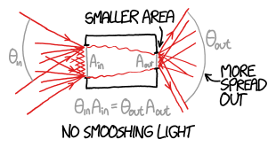
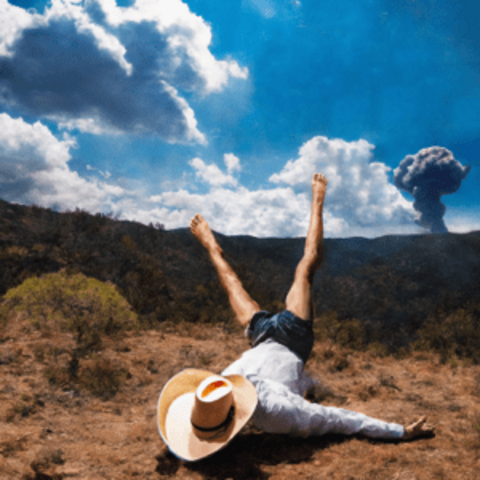
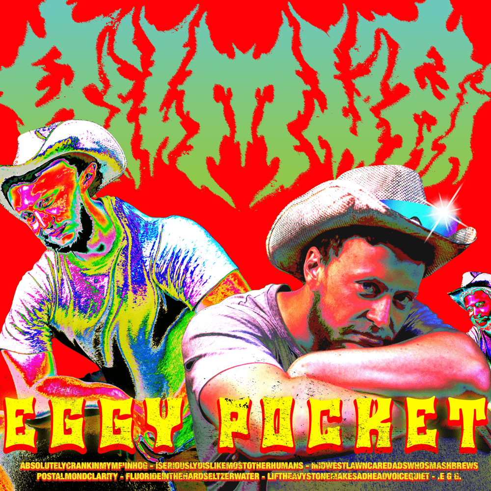
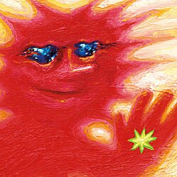

# /about

I am a PhD Student from Australia. My work is in trying to find loopholes in the ["No Smooshing Theorem"](https://what-if.xkcd.com/145/) for light. 

<figure style="text-align: center;">
    
    <figcaption>It turns out thermodynamics prevents you from smooshing light.</figcaption>
</figure>

Specifically, I am trying to use lasers to talk to astronauts, and smooshing the light is a key part of that. Checkout [this blogpost](/blogs/phdAt5Levels.md) for more details.

When I am not working on that, I like to cook, drink nice coffee or beer, or tinker technology. 

## 1 Music I am listening to at the moment

    

        

            

                
                

                    
3D Country

                    
Geese

                

            

        

        
        

            

                
                

                    
EGGY POCKET

                    
Bilmuri

                

            

        

        
        

            

                
                

                    
Forever Howlong

                    
Black Country, New Road

                

            

        

    

    
    <!-- Scroll indicator -->
    

    

## 2 Favourite Meal to cook

My favourite food to cook is Pizza. My partner and I own a small pizza oven and it is good fun.

## 3 Favourite Breweries and Cafes

My favourite brewery in Syndey is [Hopsters](https://hopsters.coop/) in Enmore. This is a co-op owned brewery, and I am one of the owners. My other favourite, which is not obviously compromised by personal relationship is [Wildflower](https://wildflowerbeer.com/) brewing. They do a whole bunch of wild ferment sours.

Internationally, my favourite brewery is the [The Klosterbrauerei Andechs](https://en.wikipedia.org/wiki/Klosterbrauerei_Andechs) a monestary just outside munich and on top of a mountain which also brews beer, or [Monkish](https://www.monkishbrewing.com/) a european style brewery in LA.

In terms of coffee, I legitimately believe that Australia has the best coffee in the world, so I don’t have any memorable experiances internationally despite looking. Even when I travelled, people used to tell me when a cafe was owned by an Australian as a mark of quality.

## 4 What Parts of Science am I most excited about?

Well obviously optics and photonics, thats why I am doing my PhD in that. Outside of that, here are the bits I am keeping my eye on:

### 4.1 Astronomy
**SETI (Search For Extraterrestrial intelligence)**

I don't expect to find Aliens in my lifetime, but SETI is a great excuse to study the very edges of what is epistimalogically possible. The current state of research incorporates epistamology, communication theory, quantum information theory, and high precision photonics. [Here is a blogpost](/blogs/Aliens.html) about a paper I really enjoyed recenetly, and [here](https://arxiv.org/abs/2407.07097) is a link to another paper I enjoyed but didn't get round to translating to a general audience

### 4.2 Physics
**Quantum Sensing**

I know the world is mad keen about quantum computing. I did a little bit of Quantum Computing research during my undergrad, which has left me a little veiled and skeptical about the whole field. Maybe it'll work, or maybe it's just the next nuclear fusion (Just 5 more years guys). 

Quantum sensors are already hitting the market however, and I think they are really cool. They occupy an interesting area, because in many cases, the physics has lying around for a while, but we have only just gotten our Computer Science and Computer hardware to the degree that we can actually use them.

The technology is crazy cool, things like measuring how Earth gravitational field is distorted by mountains to determine the density of that mountain, to figure out what it is made out of. 

### 4.3 Chemistry
**Metamaterials**

Okay, I haven't been keeping an eye on chemistry all that much, but I wanted to list it ofr inclusion. Does Meta-materials count as chemistry or physics,  go argue about it on my guest book. Nonetheless, keeping up with some of the crazy materials humanity is figuring out how to build is really exciting. 

### 4.4 Biology
**Engineered Microbiology**

My current obsession in biology at the moment is almost entirely due to watching the crazy work done by [Thought Emporium](https://www.youtube.com/@thethoughtemporium). Learning about the current state of direct gene editing for protein synthesis is really exciting. I get excited about the possibility to produce massive complex structures biologically, for human application. 

### 4.5 Maths and Computer Science
***Sigh***  *I know, another techie who is excited about AI - I know*. But seriously, I have been tracking the progress of LLMs closely and have been very excited by the progress. - no I don't think they are going to replace everyone like the marketers think - but I also don't think the stochastic parrots are completely useless. 

I've also been keeping an eye on ML more broadly for their information processing abilities in general. My PhD relies on some simple ML applications, and it feels like more than half the PhD student's I know in physics have ML somewhere in their work. It's quite remarkable how easily it has become just another tool in the toolbox for us.

## 5 Dogs Or Cats?

Dogs
