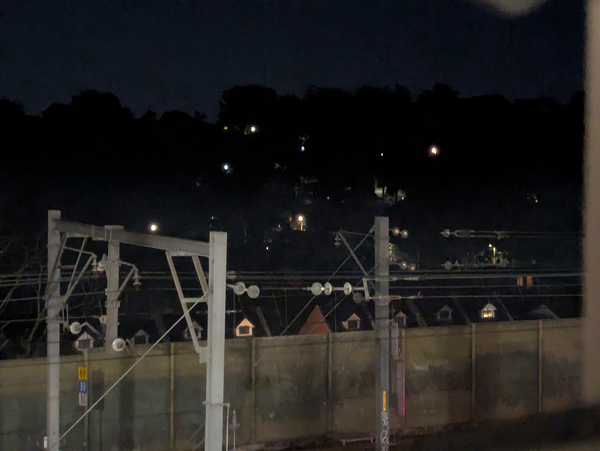
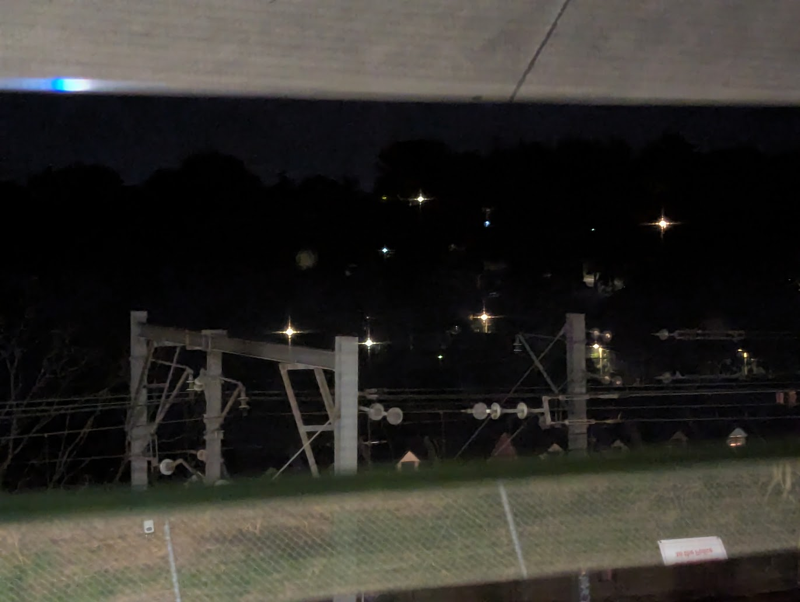
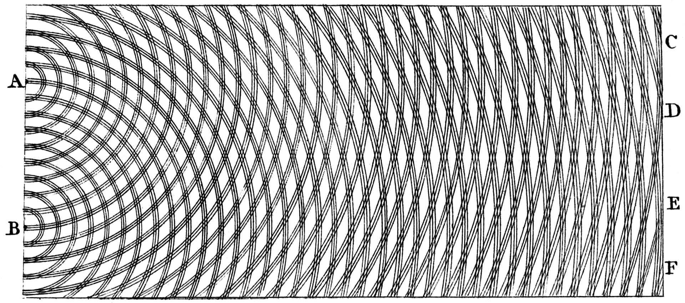
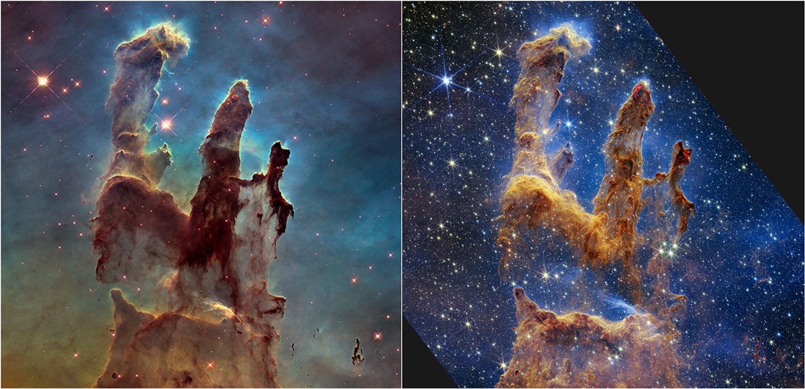
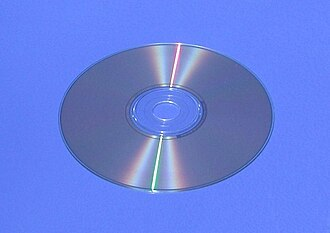
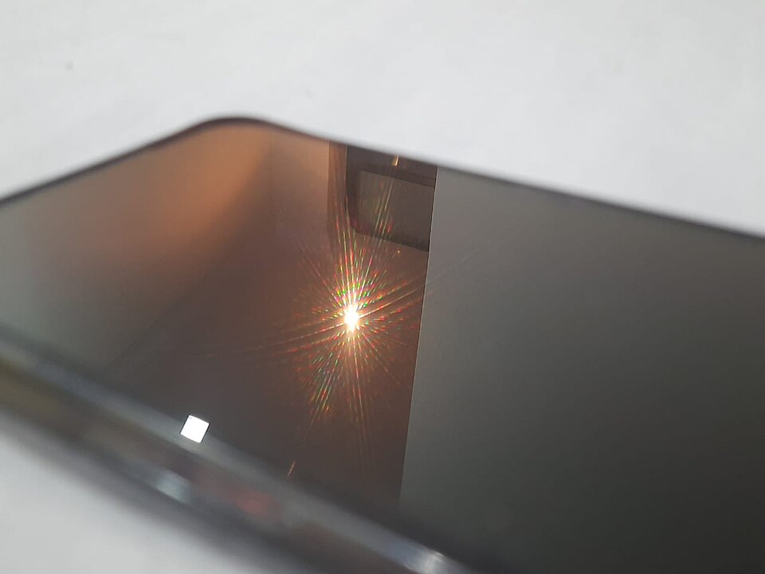

I spotted a remarkably simple demonstration of optical diffraction the other night, from looking across at the far away lights on the otherside of the train tracks from a balcony. I noticed they  looked quite different dependng on whether the flyscreen was open, or closed. Take a look:

  <h4 style="margin-bottom: 1rem;">Open</h4>
  

  <h4 style="margin-bottom: 1rem;">Closed</h4>
  

See those beautiful points? Like a four pointed star? (Like in the ✨ Emoji). Those are the "**diffraction effects**", the result of the light waves taking slightly different paths through each of the tiny holes in my flyscreen, and then overlapping and interfering by the time they get to my eyeballs (or camera). Thomas Young described this effect using ripples / waves in a water tank, showing that the waves would interfere and add up to higher peaks in some areas, and flats in others. 

  
  
<strong>Credit:</strong> <a href="https://commons.wikimedia.org/w/index.php?curid=2468490">Public Domain</a> — Thomas Young's sketch of two-slit diffraction for water ripple tank from his 1807 Lectures

The exact pattern for each of these lights could be calculated by a second year physics student (I distinctly remember cramming these textbook chapters) , you just take the size of the holes in the fly screen (We'll call them $a$) and the spacing of the holes $d$, chuck in the lights "wave-vector" $k$ and you get an exact equation.

$$
I(k_x, k_y) \propto 
\mathrm{sinc}^2\!\left(\frac{a k_x}{2}\right)\,\mathrm{sinc}^2\!\left(\frac{a k_y}{2}\right)
\times
\sum_{m,n} \delta\!\left(k_x - \frac{2\pi m}{d_x}\right)\,
\delta\!\left(k_y - \frac{2\pi n}{d_y}\right)$$

Those 'Sinc's mean there is an oscillation. Which if you look carefully at the points, you can actually see on each of those light sources. The little dark spots on each of the stars "arms".

---

One obvious spot this shows up is in the images taken by Hubble and James Webb Space Telecopes. The follwoing two images are take of the same nebula (The pillars of creation), taken with successive generations of telescopes. Obviously the second has much greater detail present, but look at that, all the stars have 6 points in the second one, while hubbles only have four. Did the stars change over the course of a couple of decades? NO! This is diffraction effects showing up again, just like the fly screen in my photo above! The points were never real, they just show up because of the way the telescopes are held together. 

  
  
<strong>Credit:</strong> <a href="https://science.nasa.gov/asset/webb/pillars-of-creation-hubble-and-webb-images-side-by-side/"> NASA </a> — NASA’s Webb Takes Star-Filled Portrait of Pillars of Creation

Diffraction effects show up **everywhere** in physics. From [understanding the structure of DNA](https://en.wikipedia.org/wiki/Rosalind_Franklin) to probing the [quantum entanglement](https://en.wikipedia.org/wiki/Delayed-choice_quantum_eraser). If you have ever seen a [solar glory](https://rainbowspec.observer/glories/index.html) or [corona](https://rainbowspec.observer/corona/) you have seen diffraction in action. Same for that rainbow effect on CDs, or that funny reflection from your phone screen

  

    
    
<strong>Credit:</strong> Public Domain

  

  

    
    
<strong>Credit:</strong> <a href="https://commons.wikimedia.org/wiki/File:Screendiffraction.jpg">Wikimedia</a>

  

Anyway, this was a short post. Hope someone learned something from this. I had just never seen such a simple demonstration of the effect with my own eyes. If you are a teacher or educator, please feel free to recreate or even use the images directly. No attribution required. (But an email is always nice)