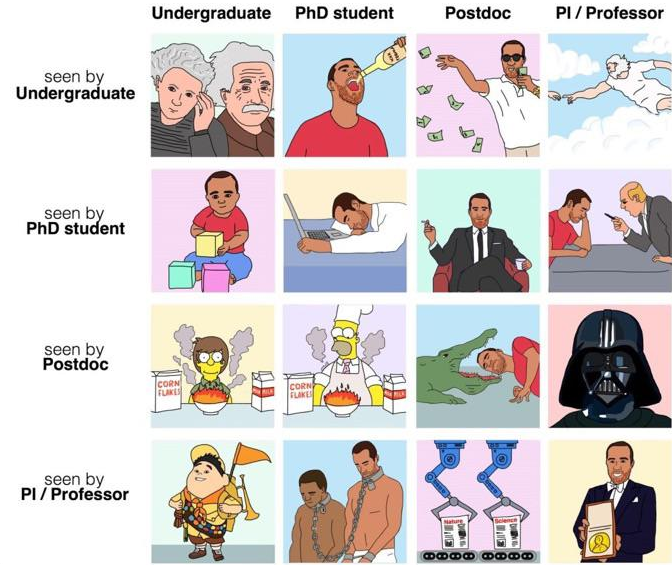
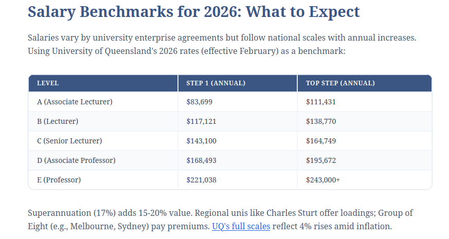

Basically no one outside of Academia actually understands how Academia works. That's understandable, I don't really know how a law office works. In anycase, here is a super short rundown on the Acedemic Food Chain

## 1 The Food Chain
### 1.1 Undergraduate

These are your Bachelor's Degree which is what most people do when they  "Go to uni" for a few years after highschool. This is generally a 3 year course, but can be longer if you take a double degree, change subject etc.  This is almost 100% classwork, though there are a few undergrad research projects avaliable in Australia. 

Important to mention ins the **Honours Year / Honours Degree**. This is a *weird* Australia\* specific thing. In Australia Honours =/= An award for being good. Instead it is an optional 1 year extension to your bachelors where you get to do research. People describe it as a "mini-PhD" since you need to find a topic and get all your research done in 12 months. 

\* UK, New Zealand, South Africa and a few others also have honours degrees or similar. 

### 1.2 Masters Students:

These are more rare in Australia (My office has 0 masters students at this point).  If you have a Bachelors degree (not necessarily an honours), you may pursue further education for another 1-2 years. This can be more classwork and/or research. 

While not exactly unheard of here in Australia, many people who want to pursue a career in academia will skip this step, since if you have good enough marks in your honours year, you can go straight into the next stage

### 1.3 PhD Student

I describe PhD students as the academia version of a trade apprentice. *Technically* we are a student, but in terms of day-to-day work, we are part of the team and doing research etc. This is emphasized by the meme amongst PhD students of calling ourselves *students* when we are trying to get student discounts, but *PhD Candidates* when we are trying to sound impressive at conferences. 

Also like a trade apprentice, we get paid like shit (but unlike the lower levels, we do get paid\*), and do all the messy, boring and shitty work that no one senior wants to do.   A PhD typically takes 3-4 years in Australia, without a definitive end-date. Instead it is "done" when you finish the work. This typically means a substantial amount of research reviewed by experts in the field. 

 \*The money situation for PhD students is a little strange and filled with exceptions. However broadly speaking, most PhD students do not pay to study, instead their tuition is covered by a scholarship which also pays them.  This means we don't pay tax (yay!), but we also don't get super or the same rights as employees (boo!).

### 1.4 Post-Doc

 This is the first point where you are no longer a student. But a full time working scientist (or whatever you call yourself in the field).  At this point you are getting paid above the poverty line, but you are on contract work.  Unlike a PhD, “postdoc” is not really a formal rank. It usually means a researcher with a PhD who is working on a **fixed-term research contract**, often for 1–3 years at a time.
 
  Your ability to stay employed is now based around your ability to get on senior researchers funding, or to secure funding yourself to pay for your employment and research.   Post-Docs are also the first step where you can be a lecturer to start teaching undergrads. (Though tutoring is common for PhDs, Masters and even Honours). 

The long term aim for post docs is to get onto an ongoing contract as a lecturer (teaching position) or research fellow (no teaching). 

### 1.5 Associate Professor and Professor

After building a strong profile you can make your way to Associate Professor and eventually Professor.  At this point you are usually an established research or teaching leader rather than simply an individual contributor. The higher you reach, especially from associate professor to full professor means increasingly your contribution is making it possible for  other people to do the research. In another word, the work increasingly resembles management. 

## 2 Pay

Like any industry, pay varies drastically. The following table shows the current (2026) payscales from University of Queensland. 

https://www.academicjobs.com/higher-education-news/academic-position-levels-australia-explained-academicjobs-10488

Many fixed term post doc positions hover around the same pay as level A->B on the table. 

PhD students typically pick up a scholarship or stipend. That said, the pay is small and has not adequately kept up with cost of living. Currently most of the students I know sit at around $44,000AUD per year. This is *slightly* improved by the fact that this income is tax-free (since it is a scholarship not a salary),  so the take home pay is better than the equivalent from a worker earning this much.  Many PhD students pick up extra part time work including tutoring or marking in order to pay for living expenses. 

## 3 Who Pays for it all?

The university pays for less of it than you think. Much of the costs, including the salaries of the researchers, are paid for by research grants, either from government or other institutions. The higher on the ladder you climb, the more responsible you become for searching for and acquiring funding to keep your institution and junior researchers paid. In Australian physics labs the Australian Research Council, are the big governement spenders, but public/private partnerships are common (I know students whose PhDs are funded by a telecommunications company),  

The constant search for grants is responsible for a lot of the instability associated with an acedemic career. I personally know a postdoc who lost their job after they WON a grant.... because the grant wasn't processed until after the contract ran out. 