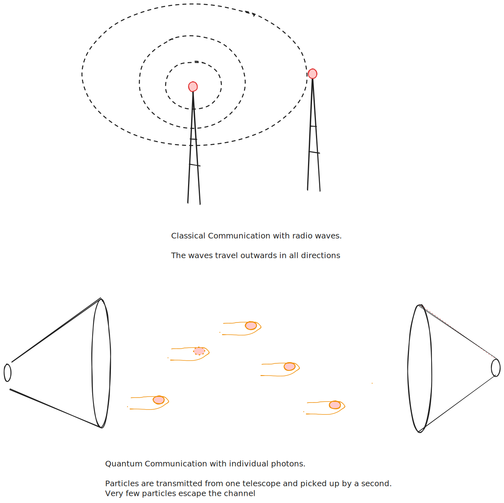

## \...They just aren\'t talking to us

I read a paper exploring a novel explanation for why the universe is so
darn quiet.

For those unacquainted, the [Fermi
Paradox](https://www.space.com/25325-fermi-paradox.html) is the simple
question. "Why is the universe so quiet???". This follows the [Drake
Equation](https://en.wikipedia.org/wiki/Drake_equation) which is a kind
of napkin math estimate of how many aliens there are in the universe.
You simply take the number of stars in the universe, multiplied by the
percentage of those stars with planets, multiplied by the percentage of
planets in the habitable zone, multiplied by the probability of life
spontaneously developing. While we don't know the true value of any of
these numbers, even a conservative estimate for each says there should
be plenty of aliens out there for us to find. Simply because the
universe is so big, and there are so many stars!

There are many explanations for the Fermi Paradox. Most of them make
great premises for Sci-Fi works. From the great filter hypothesis (seen
in *Mass Effect*) to the Dark Forest hypothesis (seen in *Three Body
Problem*), to the Berserker hypothesis (seen in *Berserk*). A paper that
hit the ArXiv last month has a novel explanation for why we can't hear
any aliens.

In a sentence.

*They aren't talking to us*.

But, why aren't they talking to us? And why can't we overhear them
talking to each other? That is what this paper addresses.

The author of the paper suggests that interstellar civilisations may
prefer to communicate using quantum communication. The reasons for this
are beyond the scope of my blog post, but in short, you can get more
data, faster, and more securely and lets you do a bunch of things that
are impossible in non-quantum communication.

The physics of Quantum Communication puts some hard limits on what we
Earthlings could expect to hear

When we do "classical" communication here on Earth. All that matters is
that the signal is louder than the background noise. Think about
communication like speech, if you cannot hear your interlocutor inside a
noisy restaurant, you will simply ask them to increase their volume, and
you will be able to understand them.

Radio communication on Earth is like a lightbulb in a dark room. It
sends signals in all directions, and if someone can't hear the message
clearly, we just use a stronger "bulb". This works because we only need
the signal to be louder than the background noise to understand it.

Quantum communication is different. Quantum communication leverages the
particle-like properties of light (or other quantum things). This means
that the limit is no longer that a signal is louder than the background,
but that a large enough percentage of the individual particles that are
sent get received. The consequence of this is that you cannot just "turn
up the volume" if the receiver isn't getting the signal.

This is less like speaking in a restaurant, and more like a game of
catch. If your ball partner is only catching 50% of the balls you throw,
simply throwing more (turning up the volume) won't help improve their
catch rate. Instead, you need to move closer and throw more accurately.

For effective quantum communication, the MAJORITY of the signal
transmitted must be received to work. As a result, quantum communication
requires small wavelengths. These signals would be transmitted by a
telescope on one end, and received by another telescope on the other.
These laser beams of signal can then be passed through space with high
accuracy, allowing most of the signal to land on target.

This means that if all the aliens out there are communicating using
Quantum communications:

**a**.  They must have **extremely** narrow beams. So it is near impossible
    for any stray signal to hit us. Remember, the majority of the signal
    needs to hit the receiver, and any that hits us isn't hitting the
    receiver.

**b**.  They must have **MASSIVE** telescopes to suck up all those photons.
    And by massive, I don't mean hundreds of meters wide, or even a
    kilometre wide. In order to send a quantum signal between us and our
    closest neighbour, quantum information theory predicts you would
    need a telescope 100 km wide!

The craziest thing about this explanation is that even if aliens wanted
to talk to us, AND had the technology to do so, they would also have the
technology to see that we wouldn't be able to hear them because we do
not have any large enough telescopes.

So quite simply, it is so quiet, because the aliens are not talking to
us.

# 1 Source
Boyle, Latham. "On Interstellar Quantum Communication and the Fermi
Paradox." arXiv, August 5, 2024.
[https://doi.org/10.48550/arXiv.2408.02445](https://doi.org/10.48550/arXiv.2408.02445.).
