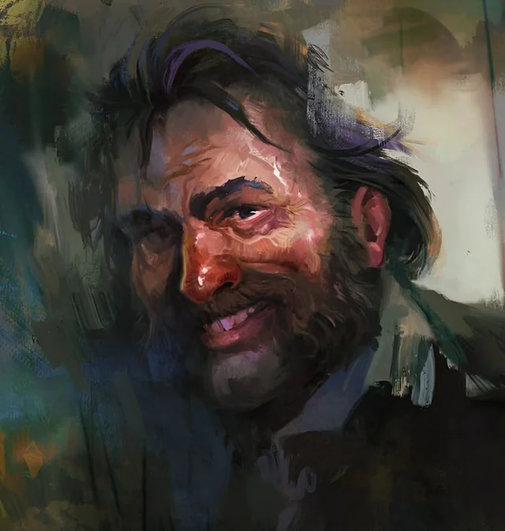
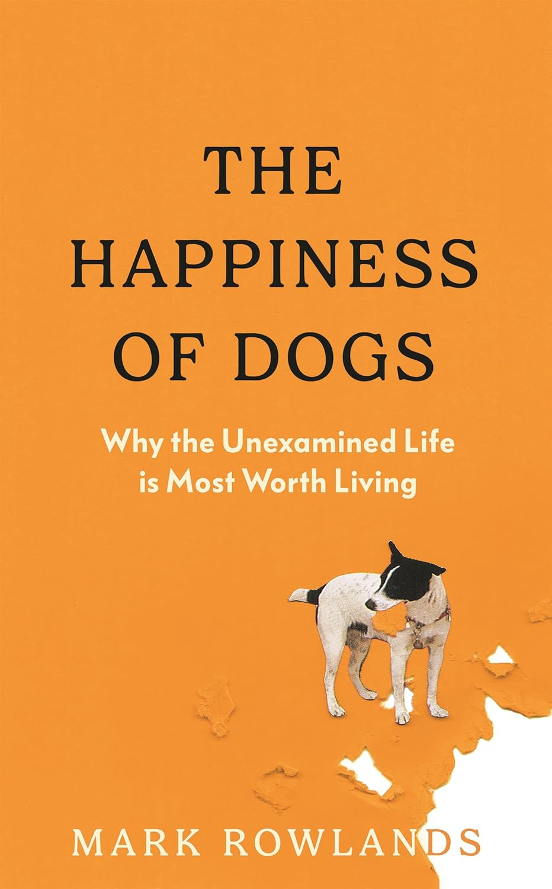
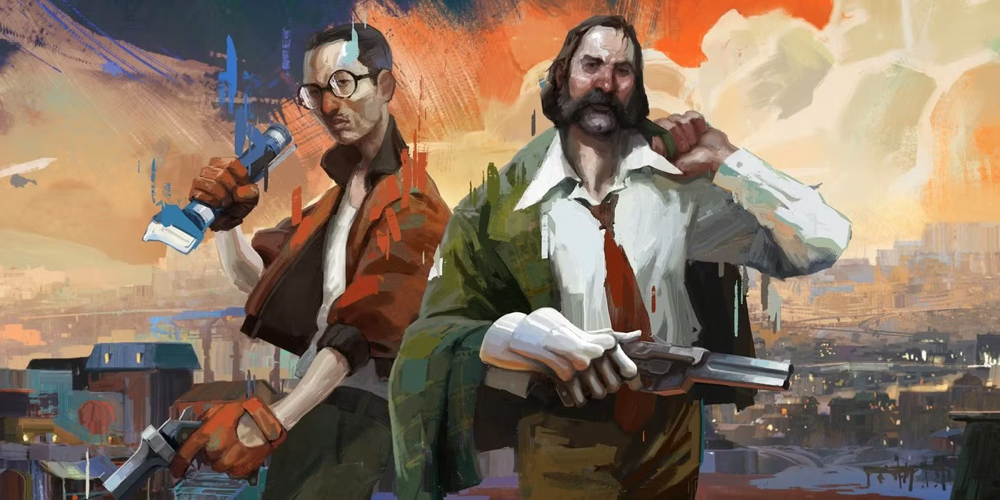
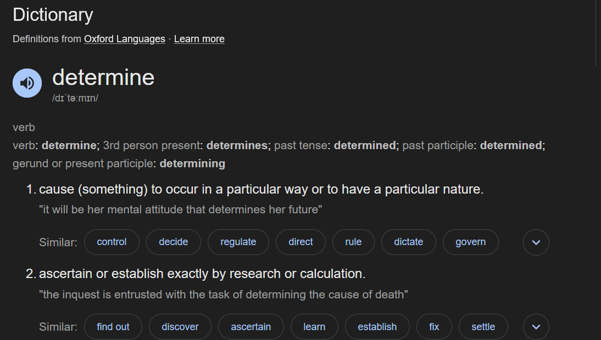
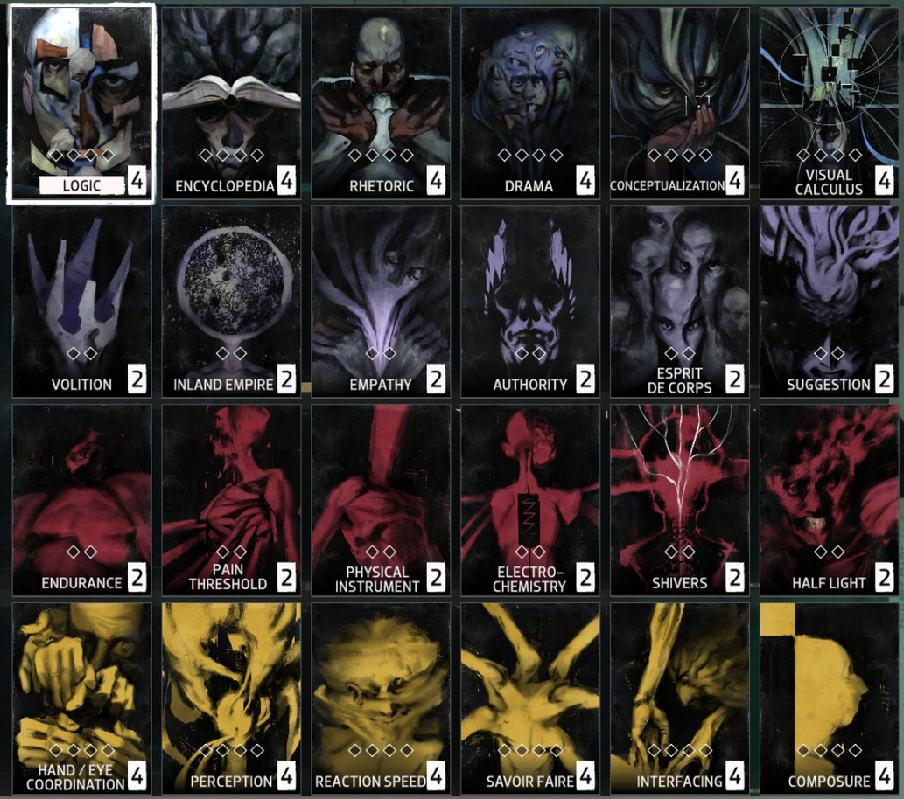
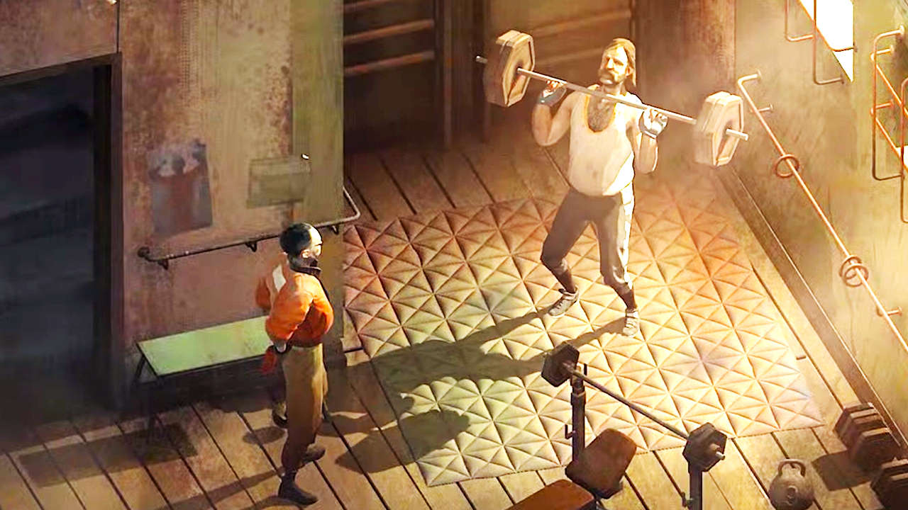

  

I've been thinking about how we find meaning in life after reading ["The Happiness Of Dogs" by Mark Rowlands](https://openlibrary.org/works/OL38127307W/Happiness_of_Dogs?edition=key%3A/books/OL51814513M). I also finally played Disco Elysium, and I think I have thoughts on applying Rowlands' thoughts to the game. A note on spoilers: I will be discussing the game without any care for spoilers. This is your only warning. Literally the very next sentence is a spoiler.

## Who Is Harry Dubois?

  

This is the central question of the game. More important even than the primary question, "Who killed the hanging man?" 

A quick look around Harry's hotel room makes it pretty clear that he is not a fulfilled person. The room is dirty, furniture destroyed, and it is littered with empty alcohol bottles. 

"Why am I like this?" and "Can I ever be happy?" are reasonable questions he finds himself asking.

It quickly becomes clear whatever happened the night before, was not an isolated incident, but the climax of an escalating pattern of self destructive hedonism. 

Throughout the game, we must answer the question "Who Is Harry Dubois?". One might even say, that ***Harry's existence precedes his essence***. From this broken man, can we determine his identity?

## Rowlands Philosophy

In the final chapter of his book, Rowlands puts forward three bad theories for how people attempt to justify meaning in life, and proposes his own good theory which he thinks works better. These theories are:

### 1. Subjective Expression

The subjective expression model for life's meaning is essentially a Hedonist model. To express meaning under the subjective model is to find meaning in doing the things you enjoy.

There is a pretty obvious flaw with this philosophy. What if you **like** getting drunk, doing drugs and asking strangers to "have the fuck with you".

It is clear that Harry's life was not one that could be reasonably described as meaningful. Some kind of higher priority is needed. 

### 2. Objective Expression

The objective expression of meaning is the foil to the subjective expression. In this framework, meaning is expressed through doing things which are "objectively" valuable for your community. 

Rowlands has a retort to this: what about the cancer researcher who is miserable at work? Many would struggle to call a life like this "meaningful" if they hate their career. 

Around the middle of the game, Harry might make some attempt at objective expression of meaning. Depending on the decisions he makes, he will be invited to find meaning in politics. He can study race science with the fascists, grind to increase his net worth with the capitalists, "read theory" with the communists, or navigate the bureaucracy of the liberals. No matter which path Harry chooses it quickly becomes clear that neither he nor the people he is working with truly find contentment in their ideology. Political Ideology is a poor substitute for an identity. 

Clearly some alignment between the individual's enjoyment and the objective expression measure is necessary in order to find meaning.

### 3. Hybrid Model

So what if we just split the difference? We might argue that a meaningful life is when you find something that is "objectively valuable" AND that you enjoy it.

This begs the question: how might one define "objective value"? This is obviously a sticky question which requires a great deal of hubris to think you have an answer to. As such, any model based around "objective measures of value" is completely unworkable.

However, the hybrid model does provide some insights that make it appealing, and motivate Rowlands' Nature model

The hybrid model has two key attributes which most intuitively feel is correct:

1. Finding meaning **should not be easy**, it should take work.
2. There needs to be a chance that you are **wrong** about your conclusions. You should be taking a risk.

### 4. The Nature Model

The model Rowlands puts forward is the "Nature Model", where a meaningful life is one in which you act in line with your nature.

He illustrates this through the life of a dog, who he argues, typically finds this task easier.

Herding is in a Border Collie's nature, and they find meaning in herding things. German Shepherds are naturally protective, and find meaning in barking at the mailman, and Cavaliers find meaning in cuddling their owners.

Humans have a much more difficult task in front of us. Our nature itself is malleable. **"Existence precedes essence,"** as Sartre argues, which means that we, and our nature are defined by our actions. This means any attempt at objective meaning is fundamentally groundless. We are **"condemned to be free,"** he says.

Rowlands spends much more time on this, and I won't pretend to be an expert on Sartre. So I will summarise the argument as follows:

- Human nature is not defined by our genetics like a dogs,
- Instead it is created by ourselves, and will change as we do.

The challenge is then, how do we determine our nature in order to act in accordance to it.

##  The Nature of Harrier Dubois

  

The story of Harrier Dubois is his mission to determine his identity. This determination must look backwards and forwards. He must look backwards to recall his name and history, and forwards, taking action to forge his present and future. 

That is to say, he must determine his identity in both senses of the word.

  

When considering his nature, it certainly seems like addiction is a natural contender. His electrochemistry is one of the loudest voices in his head*, constantly telling him a drunk and an addict is who he is. It is clear that Harry doesn't find meaning in these acts of self-destruction. So what is happening here? 

***The voices lie to him***. Harry's own Volition reminds him of this when speaking to Klaasje Amandou "*Miss Oranje Disco Dancer*", Harry's volition tells him that the voices of Drama and Electrochemistry are compromised and cannot be trusted to make judgements about her. 

  
*A Note on Harry's Voices

  

    
The game handles skills in a unique and interesting way. Instead of dumping points into your Constitution, Strength, Dexterity, Wisdom, Intelligence, and Charisma (or other equivalents), Harry has a number of "Voices" in his head which advise him as he talks. The player is prompted to put points into these skills, which improve the advice they give Harry.

    
In this way, every conversation in the game is actually a three-way conversation between Harry, his interlocutor, and the voices in his head.

    

      
    

  

So when does Harry act in accordance to his nature? Harry's nature is expressed both in his history and his present. His history is drip fed throughout the story. Throughout the story, Kim remarks that Harry loves to run, he runs everywhere crossing the city multiple times a day and Kim struggles to keep up. (This is what we detectives call a clue, considering the very obvious difference in health visible in just the silhouette of the two characters). Harry's Moral is boosted when he is able to achieve physical feats, like lifting the barbell in the abandoned apartment. 

  

It is eventually revealed towards the end of the game, that these expressions are the result of his past life as a gym teacher. In this way, Harry's past has shaped his present, allowing him to find meaning in the flow state achieved through unity of mind and body. 

Things begin to click, Harry's history shapes his nature. To run everywhere is part of his nature. 

This is only one example, and the ways in which Harry's past come to haunt, or empower him will vary as players select different choices. 

Another, more universal experience, is in Harry's initiative and intuition. Despite the alcohol-induced amnesia, his experience as a detective is expressed even instinctively. He intuitively knows how to interrogate a witness, knowing which information to reveal and which to keep secret. In spite of Harry's unprofessional and "unorthodox" behaviour, Kim cannot help but admire his skill and effectiveness as a detective, even in Harry's compromised state. Once again, this aspect of Harry's nature is formed by the relationship between Harry's history, and his desires. He was once a highly decorated detective, and despite the amnesia, Harry still finds meaning in solving these mysteries though traditional detective techniques. 

Harry's self actualisation as described above only happens late in the story. Prior to the story he is a broken man, trashing his hotel room, blasting Disco* music and screaming out:

  <strong>"I DON'T WANT TO BE THIS KIND OF ANIMAL ANYMORE"</strong>

\*The Disco in question

<iframe style="position: absolute; top: 0; left: 0; width: 100%; height: 100%;" src="https://www.youtube.com/embed/bh75iZ7wsDU?si=SrMKfbFH_X-H9tuA" title="YouTube video player" frameborder="0" allow="accelerator; autoplay; clipboard-write; encrypted-media; gyroscope; picture-in-picture; web-share" referrerpolicy="strict-origin-when-cross-origin" allowfullscreen></iframe>

Ruled by his electrochemistry and his drama voices, Harry has convinced himself of a lie. That his identity is static, and that an addict is a part of that static identity. Within this framework, Harry's most destructive tendencies are amplified.

Ironically, it is only through the complete obliteration of his identity that he finds the motivation to construct a new identity. Through reconsidering his past in relation to who he wants to be, he is able to piece together an identity which enables a method to endure the pain and get back up. This is not achieved by introspection, but through action and creation. Harry's identity is as much a matter of construction as it is reflection. This is not to say that Harry is a happy person at the end. Life isn't that simple. Who Harry becomes is someone who can live through the pain. Harry has found an identity which allows him to act in line with his nature, and find the meaning to wake up every day. 

As Nietzsche would put it: 

  "He who has a why to live can bear almost any how" 

# Related Works

This cool fan animation by AnafDraws:

<iframe style="position: absolute; top: 0; left: 0; width: 100%; height: 100%;" src="https://www.youtube.com/embed/hm38-8p8qbo?si=Zgm0Iho_K9K2rtyu" title="YouTube video player" frameborder="0" allow="accelerometer; autoplay; clipboard-write; encrypted-media; gyroscope; picture-in-picture; web-share" referrerpolicy="strict-origin-when-cross-origin" allowfullscreen></iframe>

- Jacob Geller - [Searching for Disco Elysium](https://www.youtube.com/watch?v=Md5PTWBuGpg) (Video Essay)
- Adam Millard -  [What Is Disco Elysium About](https://www.youtube.com/watch?v=WZITfuZPt9g) (Video Essay)
- Keith Gordon - [The Miracle Animal and the Pale Inside: Existential Thought in Disco Elysium](https://haywiremag.com/features/the-miracle-animal-and-the-pale-inside-existential-thought-in-disco-elysium/) (Essay)