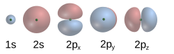

The other day I read [this great blog-post about why you shouldn't anthropomorphise LLMs](https://addxorrol.blogspot.com/2025/07/a-non-anthropomorphized-view-of-llms.html). I agree with all the specifics of the post, but also slightly disagree with AddXorRol's epistemic framework.  Then I read this response by [seangodecke](https://www.seangoedecke.com/anthropomorphizing-llms/) explaining why you should. I went into it assuming that Sean would bring up my criticisms, because they seem so obvious, but he took a completely different angle to me. So I figured I will throw my hat into the ring about why I think sometimes it is useful to anthropomorphise LLMs (even if it is not the most correct framework).  

## 1. Chemistry

I want to start by asking you to consider how we talk about chemistry. You have probably seen the following diagram of the atom:

Generally, we call this the Bohr Model of the atom. This is not what atoms look like.

The *current* consensus model for understanding the atom is generally called the **Quantum Mechanical Model** or **Schrödinger Model**. which is an equation which looks like this

$$i\hbar\frac{\partial}{\partial t}\ket{\psi(t)} = \hat{H}\ket{\psi(t)}$$

And for hydrogen, the first few electron probability clouds look like this:

---
> Personal Aside: If you look at the history of the atom, we go from the Dalton theory of the atom in the early 1800s, to the Thompson theory later that century, to the Rutherford model in 1908 to the Bohr model in 1913, and finally our current understanding traces back to 1927. It seems to me that assuming we are at the end of the road is a bit egocentric. 

---

Okay, so why did everyone learn the Bohr model in high-school then? And why does my Big Bang Theory TV show merchandise have a Bohr Model atom on it?

Well, it is because it is **USEFULL**. Unless you are interested in hyper-fine structure of electron stimulated emission or the [Zeeman Effect](https://en.wikipedia.org/wiki/Zeeman_effect), the Bohr Model works, and lets you reason about chemistry in a way more compatible with human logic. Using Bohr model understanding of electron behaviour, you can design organic molecules for pharmaceuticals, design lithium ion batteries and all kinds of cool things the chemists are doing. All with an "incorrect" model of the atom. That is why you only whip out the Schrodinger Equation when the Bohr model fails. For example, if you want to predict the exact colour of light a specific molecule will absorb, or how quantum tunnelling allows electrons to pass through energy barriers.

## 2. What about LLMs

I think anthropomorphizing LLMs is kind of like the Bohr Model. It is an incorrect but highly ergonomic theory of LLM output. 

When we are considering questions of AI alignment, the mathematical formulation proposed by addxorrol is more precise, and realistically *should* be the framework that AI safety professionals use. But for Cavemen like you and  me, being able to reason about the "ethics" of AI lets us reason about the behaviour of them in more general terms. I can say things like, [Anthropics Models are Snitches compared to Chinese equivalents](https://snitchbench.t3.gg/). 

In another example, if we look at the current [MechaHitler debacle with Grok](https://www.theguardian.com/technology/2025/jul/09/grok-ai-praised-hitler-antisemitism-x-ntwnfb) the most correct explanation would be to characterize  which weights got frazzled the last time the engineers let Elon go in to start chewing on wires. For you and I it is way easier to say that the most recent finetune failed to properly instill the level of cognitive dissonance required to disavow 1940s German Fascism while advocating for 2020s American Fascism on Twitter. 

    

    

## 3. How Do we Communicate with the public?

I should also acknowledge my own biases in this discussion. While I feel like I am better able to grapple with the personality abstraction when I know its limits, not everyone is a power user or understands what a $(\mathbb{R}^n)^c \to (\mathbb{R}^n)^c$ mapping is. Lacking an understanding for when your theory breaks down may pose a unique risk when talking about AI. 

This is where I am the least confident. An ergonomic abstraction doesn't cause psychological harm in chemistry, but recent reports have shown that people's misunderstanding of the "Consciousness" of AI is causing [**real** problems](https://theweek.com/tech/ai-chatbots-psychosis-chatgpt-mental-health?utm_source=chatgpt.com). So perhaps despite the utility of the anthropomorphic abstraction, it is too dangerous of an idea to present to the general public, forming some kind of [information hazard](https://en.wikipedia.org/wiki/Information_hazard). 

Communicating how a Stochastic Parrot or Fancy Autocomplete succeeds in simulating personality so well and reasoning about its behaviour to a non-technical audience **without** reverting to a anthropomorphic analogy seems really difficult. People want to believe what they see, and when they can see something which fly's past the Turing Test with ease, convincing them that they are wrong is going to be difficult. Being right isn't enough. Doctors are right about homeopathy and vaccines, and physicists are right about the geometry of our planet. To a certain segment of the population, that doesn't matter.

## 4. Concluding thoughts

I really liked AddXorRol's blogpost, he did a good job putting specific words to describe what the problems around alignment and safety actually are. I just wanted to provide another perspective for why different and less correct theories occasionally provide for more ergonomic ways of reasoning about systems. We should also learn how to use the anthropomorphic metaphor, because while "MatMul with interspersed nonlinearities" is the most accurate description of the phenomenon, I suspect it wont catch on with the public who need to understand the issue the most. 

Once again, we find ourselves living in interesting times. 