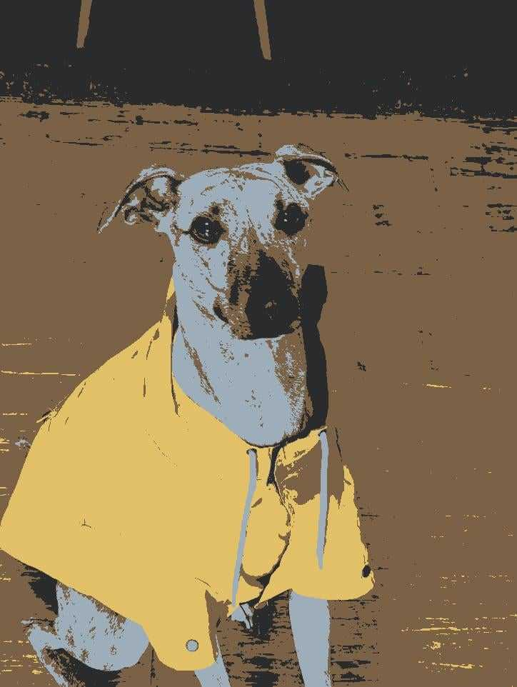
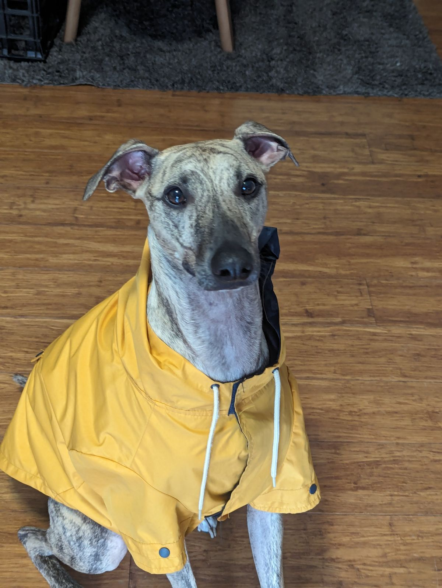
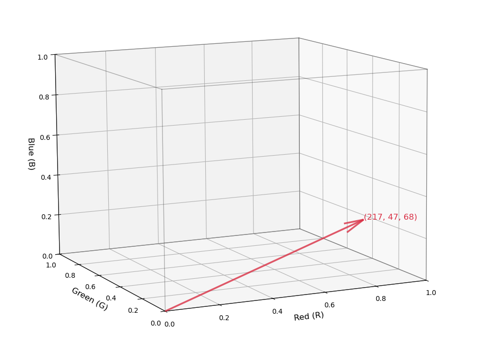
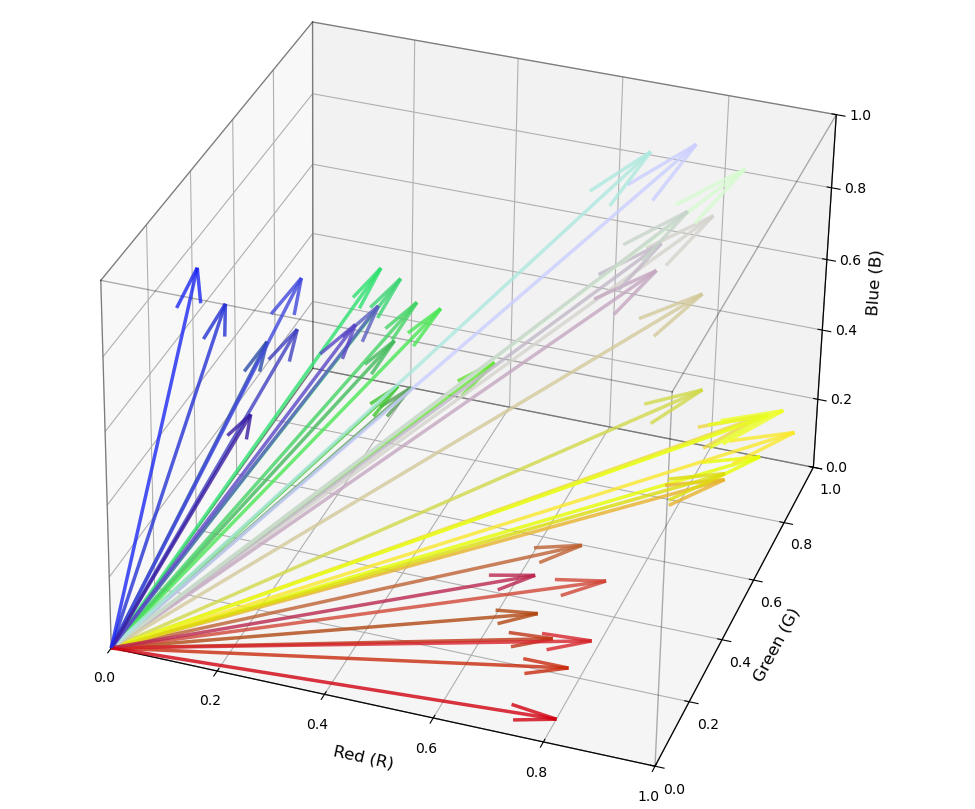
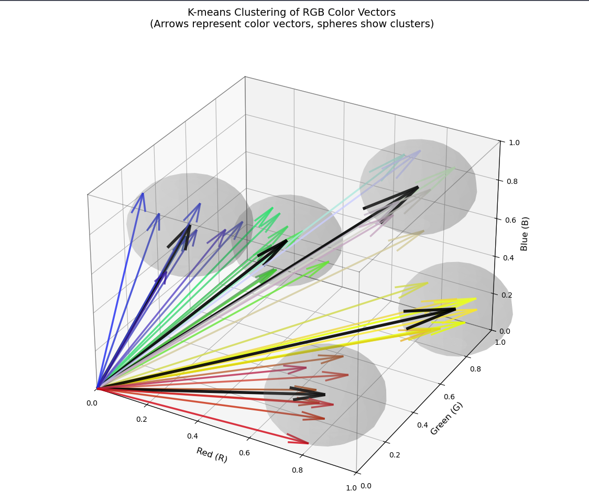
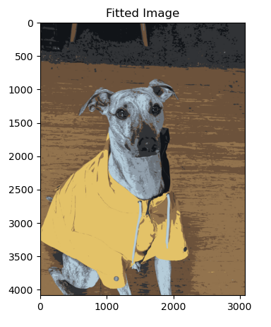
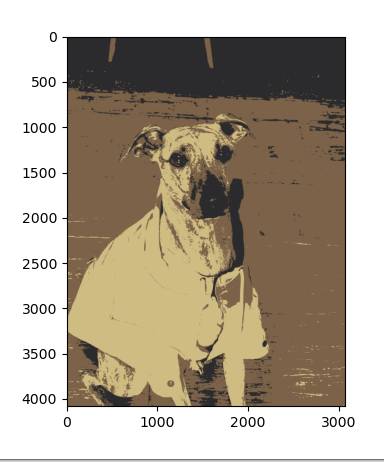

Here's a pretty photo I made using Python and some neat mathematics and statistics.

<div style="max-width: 50vw;">

</div>

So he was the original photo of my friend's dog for reference.

<div style="max-width: 50vw;">

</div>


So you absolutely could get the photo above using some filter in Photoshop or your favorite editing app. But where's the fun in that? I want to teach you mathematics.

## What even is colour

Just to start off everyone on the same page, I want to talk about color and how your computer's process them.

Thankfully, it's easy here because we only need to work with one basis. R-G-B.

As every kindergartener knows, we can make lots of colors by mixing other colors. Our computers use red, green, and blue LEDs in their monitor to create the entire spectrum of colors that we can see. This means that from our computer's point of view, every color is just a list of three numbers, R, G, and B. And specifically, it is a number between 0 and 255 for each of them.

## And now the maths

Now that we've turned colors into numbers, we can start doing maths on it.

This list of three numbers can be mathematically represented by what we call a vector. A vector in 3D space looks like an arrow. He's one I drew earlier.



This arrow represents the colour of a single red pixel. 

So the first step of our filter is to go through the picture pixel by pixel and finding what the vector for each of those colors are. If I start drawing arrows on that cube again, you can see how some of these arrows might be closer to each other than others.



That observation is the key behind what we're doing. The aim of the game is to start grouping these clusters of arrows into clusters and then we can reduce the total number of colors. This process is called K-means clustering.

The equation for k means clustering looks like this.

---

> Given a dataset $X=\{x_1,x_2,…,x_n\}⊂\mathbb{R}^d$, the K-means algorithm aims to partition the data into $K$ clusters ${C1,…,CK}\{C_1, \ldots, C_K\}$ by minimizing the within-cluster sum of squares:
>
> $$\underset{\{C_k\}}{\text{arg min}} \sum_{k=1}^{K} \sum_{x \in C_k} \|x - \mu_k\|^2$$
> Where $\mu_k$ is defined:
> $$\mu_k = \frac{1}{|C_k|} \sum_{x \in C_k} x$$
> And $||x_k-\mu_k||^2$ is the squared Euclidean distance.

---

What this means in english is that we are breaking a collection of vectors into $k$ clusters - or groups - and figuring out how to group those vectors to minimise their differences within each group. 


In Python, we can do K means clustering by calling the sk-learn library. 

```python
K = 5
# k - clustering algorithm
from sklearn.cluster import KMeans
kmeans = KMeans(n_clusters=K)
colourKlusters = kmeans.fit(colourVector)
```

But to see what we're actually doing, we can roll the algorithm ourselves and it will look like this:


```python
import numpy as np

def k_means(X, K, max_iters=100):
    # Randomly choose K data points as initial centroids
    centroids = X[np.random.choice(len(X), K, replace=False)]

    for _ in range(max_iters):
        # Step 1: Assign each point to the nearest centroid
        distances = np.linalg.norm(X[:, np.newaxis] - centroids, axis=2)
        labels = np.argmin(distances, axis=1)

        # Step 2: Update centroids
        new_centroids = np.array([X[labels == k].mean(axis=0) for k in range(K)])
        
        # Stop if centroids don't change
        if np.allclose(centroids, new_centroids):
            break
        centroids = new_centroids

    return centroids, labels

```

The clusters might look something like this in vector space



To produce the image above, all I did is say $k$ equals 5. When I run the algorithm, it then looks at where all of those arrows are pointing and groups them into 5 neat little clusters. Then we redraw the image using only the center of each cluster. 

So what you're seeing here is the same picture but reduced to only 5 different colors. I can add a little bit more detail by increasing up to 8 colours and as you can see the image looks a bit more realistic and a bit less artistic.



Or reduce $k$ to 3 to produce this:




## Bonus Tips:

If you want to do this for art, here's a few tips I realized by messing around with my own photos.
- You need a small number of very distinct colors 
- Those colors need to occupy about the equal proportions of the image

I tried it on a beautiful portrait of my partner and I standing on a grassy hill. And there was so much grass in the picture that the algorithm painted both of us green because it was trying to maximize the number of different greens it could use in order to reduce the error. 

This photo we used works quite well because we have yellow rain jacket, brown floorboards, dark brown carpet, grey dog and black features on the dog. So it fits quite nicely into k equals 5.

# The Code

```python
import numpy as np
import matplotlib.pyplot as plt

path = "DOG.jpg" #Swap this out for the path to your Dog photo

# Open Cars.jpg and show using matplotlib
img = plt.imread(path)
# Extract the reds
reds = img[:,:,0]
# Extract the greens
greens = img[:,:,1]
# Extract the blues
blues = img[:,:,2]

shape = img.shape
colourVector = np.stack((reds.flatten(), greens.flatten(), blues.flatten()), axis=1)


# k - clustering algorithm

from sklearn.cluster import KMeans

K = 5
kmeans = KMeans(n_clusters=K )
colourKlusters = kmeans.fit(colourVector)
centres = colourKlusters.cluster_centers_

fittedVector = centres[colourKlusters.labels_]

# This is the original image, we just shape it how matplotlib want it
originalReshape = colourVector.reshape(img.shape[0], img.shape[1], 3)

fittedImage = np.zeros_like(originalReshape)
fittedImage[:,:,0] = fittedVector[:,0].reshape(img.shape[0], img.shape[1])
fittedImage[:,:,1] = fittedVector[:,1].reshape(img.shape[0], img.shape[1])
fittedImage[:,:,2] = fittedVector[:,2].reshape(img.shape[0], img.shape[1])

fig,ax = plt.subplots(1,2, figsize=(15,5))
ax[0].imshow(originalReshape)
ax[0].set_title('Original Image')
ax[1].imshow(fittedImage)
ax[1].set_title('Fitted Image')

fig2,ax2 = plt.subplots()
ax2.imshow(fittedImage)

# Save the image as a jpg
path = f"./DOG_{K}.jpg"
plt.imsave(path, fittedImage)
plt.show()
```