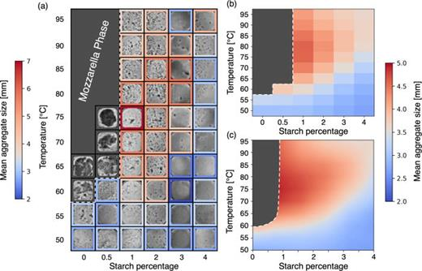
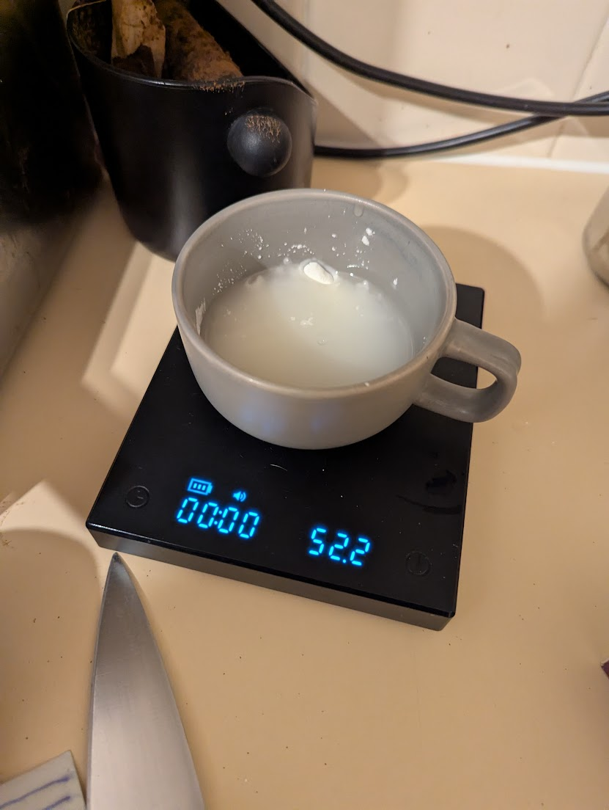
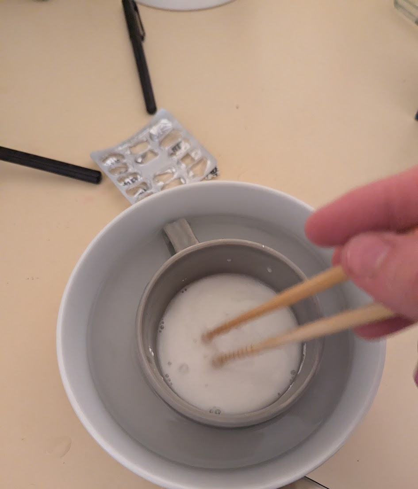
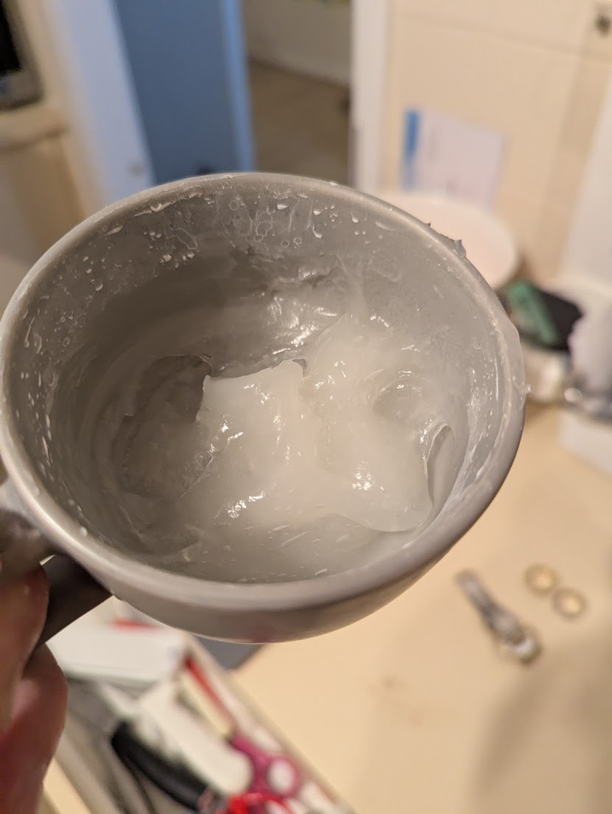
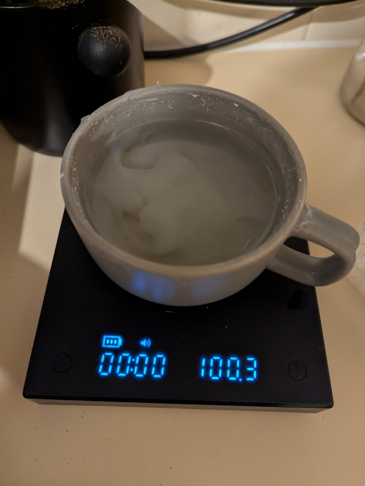
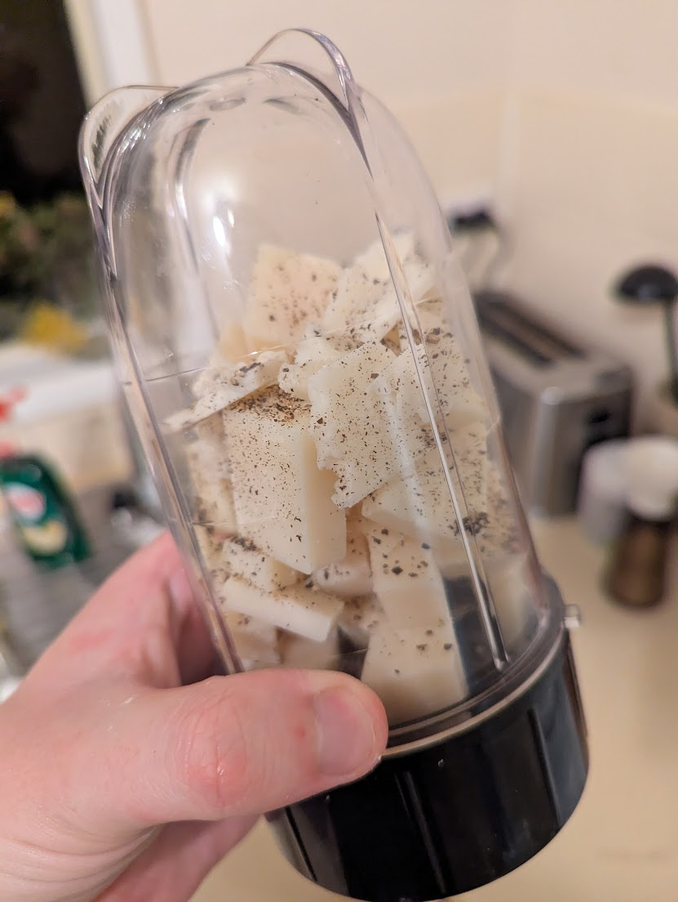
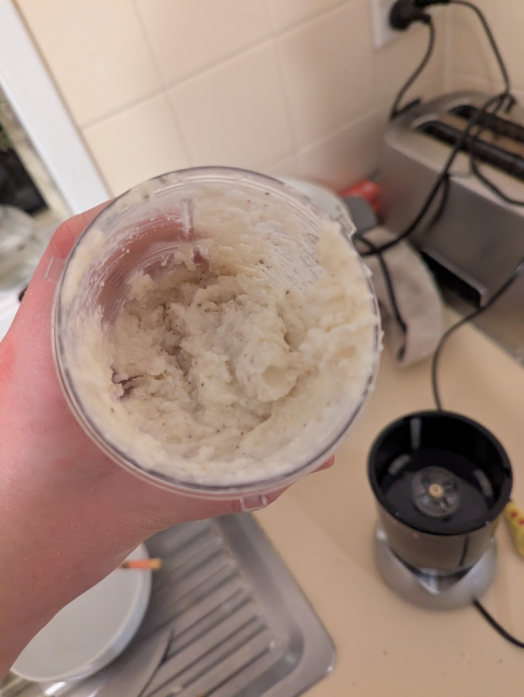
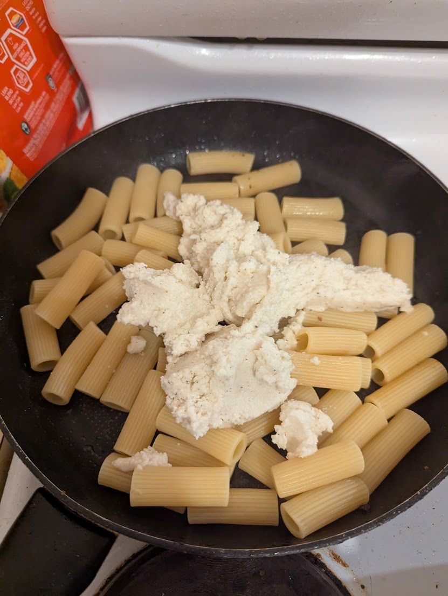
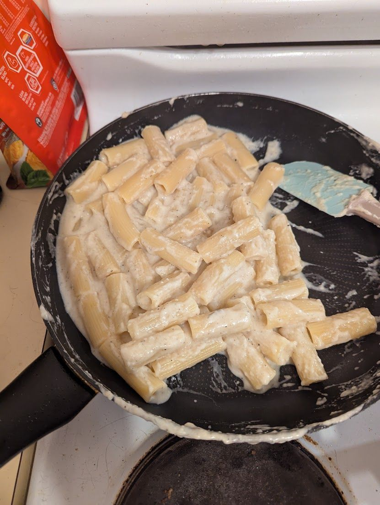
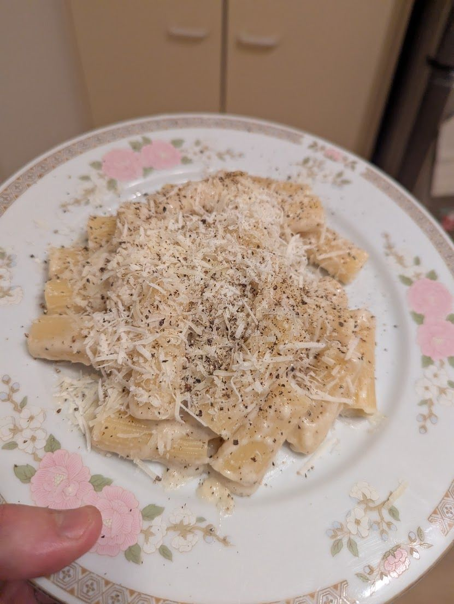

If you are a certain kind of nerd, you undoubtedly follow the Ig Nobel prizes each year. In case you don't follow them, the Ig Nobel prize is awarded each year for Science which makes you laugh, then makes you think. Previous winners include [why is belly button lint blue](https://www.abc.net.au/science/k2/lint/results.htm), and [predicting corruption of post soviet states based on the BMI of the leaders](https://onlinelibrary.wiley.com/doi/10.1111/ecot.12259).

[This years Ig Nobel Prize](https://arstechnica.com/science/2025/09/meet-the-2025-ig-nobel-prize-winners/) for physics was awarded for studying the [Phase behavior of Cacio e Pepe sauce](https://doi.org/10.1063/5.0255841). In honour of this years award, and for my dinner, we are going to prepare Cacio e Pepe as prescribed by this paper.

The dish in question is a classic Roman pasta preparation, but has a reputation for being difficult to reproduce in the home. [Adam Ragusea hypothesizes in his video](https://www.youtube.com/watch?v=n8YZeA-ZC6c) that the reason why restaurants are more successful in the preparation of this dish is that they use the same pot to boil pasta in all night, leading to increasing starch concentration within the pot.

This hypothesis is backed up by the research which isolates starch content as the most important variable in determining the texture of the sauce. 

The good news for us is that the authors present us with an ideal scientific recipe for reproducible and controllable Cacio e Pepe. The secret they propose is to add extra starch to allow us to control the starch level ourselves. This is easier than preparing a risottata like in the Adam Ragusea video, and more reproducible. 

And now, you have left the background section of the recipe blog. 

---

## 1 The Scientific recipe

### 1.1 Ingredients (Serves 2 )

- **300 g pasta** (tonnarelli preferred, but spaghetti or rigatoni also work)
    
- **200 g Pecorino Romano DOP** (optionally, up to 30% can be Parmigiano Reggiano DOP)
    
- **5 g starch** (potato or corn starch, ~2–3% of cheese weight)
- _(OR)_ **5 g trisodium citrate** (2.5% of cheese mass, dissolved in 150 g water, if substituting for starch — note this deviates from tradition and slightly blunts the cheese flavor)
    
- **150 g water total**, divided:
    - 50 g for starch solution
    - 100 g for diluting before adding cheese
        
- **Freshly ground black pepper** (to taste; toast beforehand for enhanced aroma)
- **Salt** (only a pinch, for pasta water)
    

---

### 1.2 Method

        
1. **Prepare starch gel**
    
    - Dissolve **5 g starch** in **50 g water**.
    - Heat gently until the mixture thickens and turns from cloudy to nearly clear — this is the **gelatinization point**, marked by a sudden increase in viscosity.
        
2. **Cool and dilute**
    
    - Let the starch gel cool slightly.
    - Add **100 g water** to the gel before introducing the cheese.        
    - This brings the water-to-cheese ratio to **75%**, improving stability (per Fig. 3 of the study).

3. **Incorporate cheese**
    - Blend the cheese into the cooled starch solution.
    - "Manually grating the cheese is not ideal, since it may lead to chunks of different sizes. We recommend blending it with the starch solution for a smooth, homogeneous sauce"

4. **(Optional: Citrate alternative)**
    - Instead of starch, dissolve **5 g trisodium citrate** in **150 g water**.
    - Combine with cheese as above. This produces excellent stabilization, but with a slightly muted flavor.

5. **Toast pepper**
    - Toast black pepper in a dry pan to unlock its aromas.
    - Stir into the sauce.

6. **Cook pasta**
    - Boil the pasta in lightly salted water until _al dente_.
    - Reserve some pasta cooking water before draining.
    - After draining, let the pasta cool for up to **1 minute** (slightly longer if cooking ~1 kg), to avoid destabilizing the sauce with excess heat.
        
7. **Combine pasta and sauce**
    - Toss the pasta with the cheese–starch (or cheese–citrate) sauce.
    - Adjust consistency gradually with reserved pasta water until creamy.
        
8. **Final touches**
    
    - Garnish with extra grated Pecorino and freshly cracked black pepper.
    - Serve immediately.
    - **Note** An extra advantage of this process is it survives reheating quite well

---

## 2 My Process

I opted to omit the Sodium Citrate. I would like to say it is because I wanted to be authentic, but it is also because I couldn't be bothered sourcing Sodium Citrate for this. I paired this with Rigatoni becuase I like stabbing my pasta with a fork.  Now onto the process:

The paper tells you to gently heat the starch and water mixture. But with such little water, that is easier said than done. 

My first thought for achieving the careful control over such a small volume, was to use a double boiler setup. Simply mix the starch and water in a small container, and submerge that small container in boiling water

This... did not work. The temperature we are aiming for was just too high. So I added it to the microwave for just an extra 15 seconds we hit the gelatinization point. Next time I try this I'll head straight to the microwave I think. 

With that out of the way we could dilute it to the specified concentration by adding 100g of water and loosely mixing.

Next the cheese. The paper argues that hand grated cheese can end up with cheese which is too irregular in size. Therefore I opted to grind the cheese in a blender. I cubed it, and added it in with the toasted pepper, and ground until it was a fine powder.

After I got a fine cheese powder, I added the starch and blended again.

Now the sauce was put into a holding pattern while we cooked the pasta. After cooking for the specified time, I scooped out a cup of pasta water, strained it, and let it sit to cool for a minute. Finally, I added the sauce mixture to the pot, and diluted with a little of the pasta water. Stir, stir, stir and adjust with pasta water to get the desired consistency and *Voila* perfectly emulsified Cacio e Pepe. 

## 3 Conclusions

This technique gave me a technically perfect pasta emulsification. The texture clung to the pasta without being to watery, without splitting or entering the "mozzarella phase" specified by the paper. Completely idiot proof. The fact that I could hold the sauce at room temp while I wait for the pasta to cook was another bonus. Considering how well it worked, I am tempted to try the technique again for other roman pasta styles, perhaps Carbonara could be simplified with this. More research is required.

Evaluating the pasta on its own merits however, 100% Pecorino was a mistake. I found the dish too salty, and the sourness of the sheep milk was a touch too intense. Perhaps the pecorino I picked up at Woolies is more salty than the Pecorino in Italy, but I just found it a bit much for this dish. 

I also learned that I am not good at food photography, especially while I am in the process of cooking. Harder than it looks on youtube. 