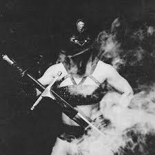
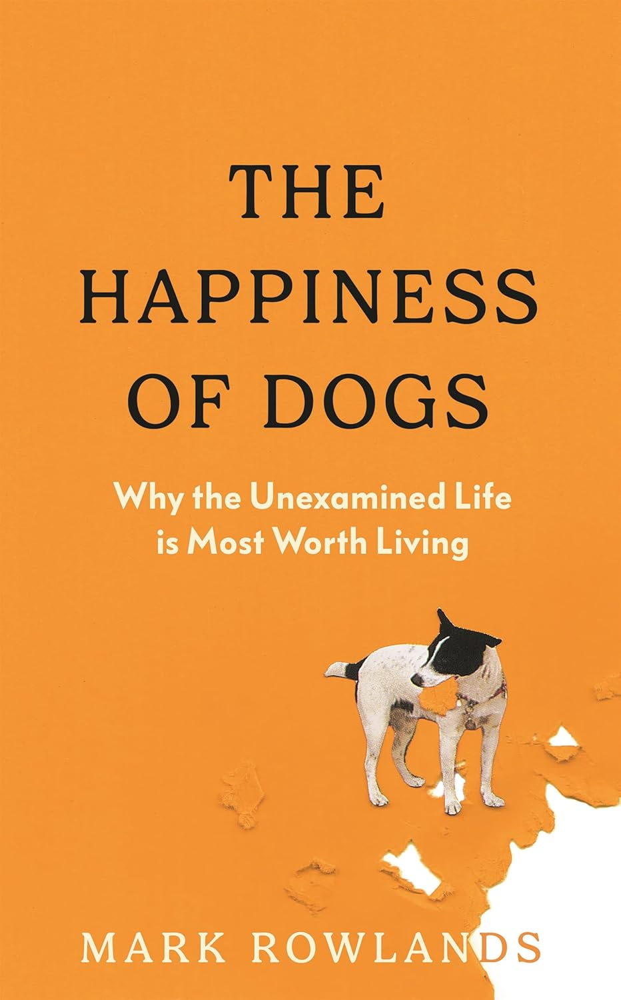
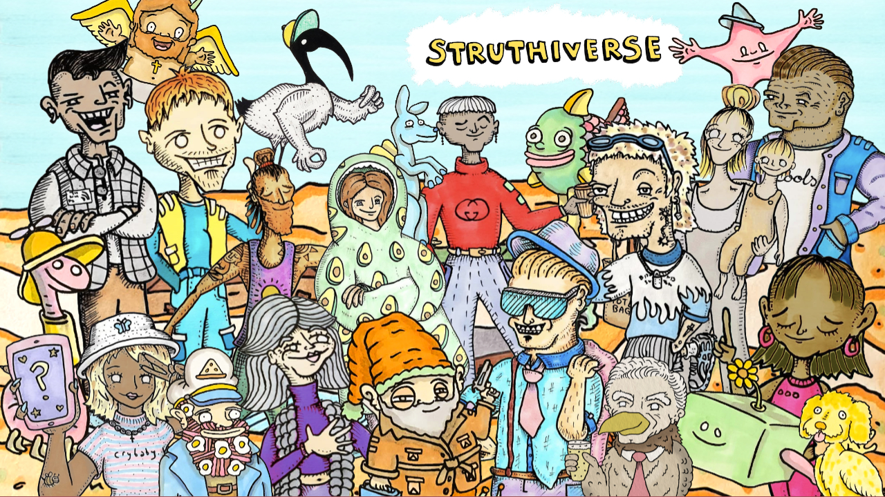
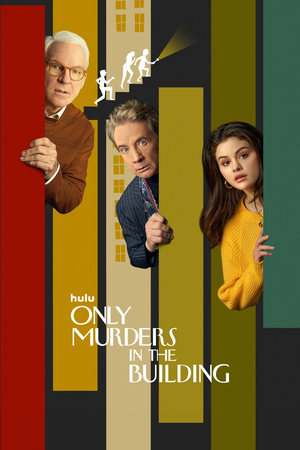
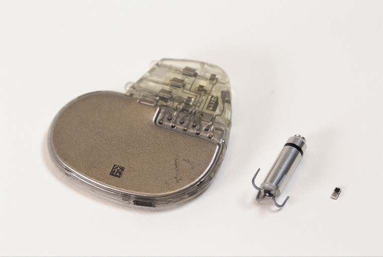
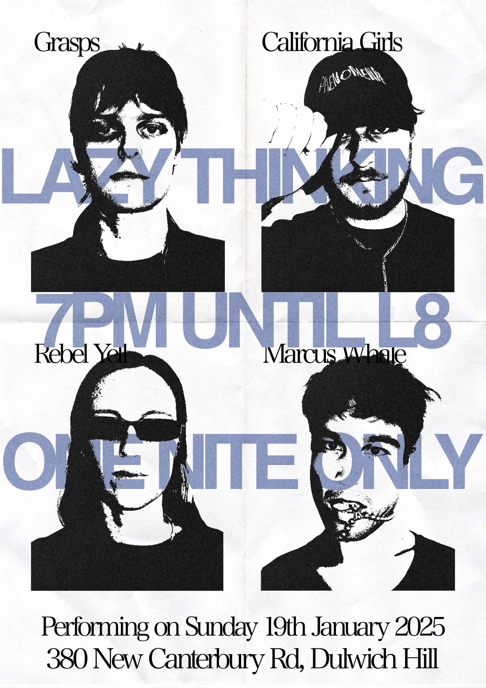

Once again repurposing the corporate webs ideas as my own. Here is MY 2025 wrapped, according to my opinion. Minor editorial note, these are the things I **liked** this year, not neccessarily the best things which came out this year.

Okay to the list;

# 1 Album

	
Creeper - Sanguivore II: Mistress of Death

	
	
I have had this record on repeat since it dropped. Its like a Campy 80s slasher flick with the best of 80s Rock, metal and pop to form a Campy, Glam Rock revival. Just look at the music video for <a href="https://www.youtube.com/watch?v=P5K3Vq1TfWQ" style="color:inherit;text-decoration:underline dotted;">Prey For the Night</a>, and you will see all the Satanic Panic, Slasher Horror, mixing with Flash Dance ad Kate Bush. Other parts of the album feature guitar riffs which would feel right at home on a KISS or Guns N Roses record. (And I swear the opening choral refraim on Blood Magik could have been an early draft for "Heaven Is A Place On Earth"). The whole Creeper project is fantastic and over the top, and reminds me of if Ghost leaned more into punk. I adore teh album and very much think you should give it a spin.

# 2 Book

	<section style="flex:1 1 280px;max-width:420px;background:var(--card-bg,rgba(15,23,42,0.04));padding:1.75rem;border-radius:18px;box-shadow:0 12px 30px rgba(15,23,42,0.12);text-align:center;">
		<h3 style="margin-top:0;margin-bottom:1rem;font-size:1.5rem;">Fiction</h3>
		<ul style="margin:0 0 1.5rem;padding:0;list-style:none;">
			<li style="font-weight:600;">Peter Watts - Blindsight</li>
		</ul>
		
		
 So this album did a number on me, and is partially responsibel for keeping my obsession with hypothetical aliens alive. I don't end up reading a lot of fiction these days, but this is really just a philosophy of mind treatise wrapped in a narrative. There is certainly a lot to think about, so I will try my best not to spoil it here. Also, Watts is a super cool dude who has the book avaliable to download for free from his website. So go do that, (and once you finish it, go buy another one for full price from him as a thankyou)

	</section>
	<section style="flex:1 1 280px;max-width:420px;background:var(--card-bg,rgba(15,23,42,0.04));padding:1.75rem;border-radius:18px;box-shadow:0 12px 30px rgba(15,23,42,0.12);text-align:center;">
		<h3 style="margin-top:0;margin-bottom:1rem;font-size:1.5rem;">Non-Fiction</h3>
		<ul style="margin:0 0 1.5rem;padding:0;list-style:none;">
			<li style="font-weight:600;">Mark Rowlands - The Happiness of Dogs: Why the unexamined life is the most worth living</li>
		</ul>
		
		
I read this one literally right after I read Blindsight and they actually dovetail quite nicely into each other, as this is another philosophy of mind book. (Though if you want a laugh, go have a read of the one star reviews on Amazon, by people whoa re angry that it isn't actually about dogs). Rowlands is a really good writer in my opinion. The book wasn't presented as a "Pop philosphy" kind of book, (and no marble statues or stoicism bros thank god), but nonetheless was quite accesible to someone like me who's main interaction with philosphy is through youtube videos. He presents several arguments which at least I find to be compelling, about how our minds work by comparing us to the current scientific understanding of how a dogs work. 

	</section>

# 3 Youtube

	<section style="flex:1 1 320px;max-width:480px;background:var(--card-bg,rgba(15,23,42,0.04));padding:1.75rem;border-radius:18px;box-shadow:0 12px 30px rgba(15,23,42,0.12);text-align:center;">
		<h3 style="margin:0 0 1rem;font-size:1.5rem;">For Doing The Most</h3>
		
BPS Space

		
		
I am routinely blown away by the expertise and commitment of the BPS channel. For the uninitiated, BPS Space is a crowd funded Space Program on youtube, and we are not exaggerating the definition of space program. While his back catalogue is filled with amature rocketry (and streatches the definition of amateur), the current long term project is a space shot, 100 km into the sky and above the Karman line. If memory serves correct he is on track to get their in 2027, after he finished designing and testing the rocket motor earlier this year. Super excited to see where the program goes.

		
Go watch the recap on his motor design <a href="https://www.youtube.com/watch?time_continue=29&amp;v=PXNxnI0s_OY&amp;embeds_referring_euri=https%3A%2F%2Fbps.space%2F&amp;embeds_referring_origin=https%3A%2F%2Fbps.space&amp;source_ve_path=Mjg2NjY" style="color:inherit;text-decoration:underline dotted;">here</a>.

	</section>
	<section style="flex:1 1 320px;max-width:480px;background:var(--card-bg,rgba(15,23,42,0.04));padding:1.75rem;border-radius:18px;box-shadow:0 12px 30px rgba(15,23,42,0.12);text-align:center;">
		<h3 style="margin:0 0 1rem;font-size:1.5rem;">Doing the most (for me)</h3>
		
Struthless

		
		
Yeah I decided to create another category for self help because I can. Struthless makes short documentaries and self help video essays, and sometimes combines the two. I am normally someone who HATES self help, Jordan Peterson and Tony Robbins make me feel slimy every time I hear them speak. Campbell Walker is not that. I need to get that out of the way, since I think a lot of people are rightly put off of self help becuase of those freaks. The videos Struthless puts out are funny and relateable (probably helps that he is a Sydney native), and often full of specific advice. The other component worth praise is he has ADHD and is open about it. So for a certain kinda person (*cough* me), his specific productivity advice works better than some of the more general audience advice I have heard previously. 

		
Anyway Struthless gets a particular shout out htis year because his videos on encouraging creativity have gotten me out of more than one slump and often remind me to write and post to this very website. So if you enjoy any of my essays / blog posts, he deserves at least some credit. 

		
Technically I first watched this video when it released around 2 years ago, but it remains my favourite, blending art, history, music and self help into one brilliant video. Watch it <a href="https://www.youtube.com/watch?v=BAO6MD7Qc44" style="color:inherit;text-decoration:underline dotted;">here</a>.

	</section>

# 4 Blog

	

		<a href="https://dynomight.net/" style="color:inherit;text-decoration:underline dotted;">Dynomight</a>
	

	
 I really like the posts Dynomight makes. I appreciate their curiosity, and willingness to post opinionated but well resarched arguments about things I have never otherwise thought about. 

	

# 5 Videogame

	
Death Stranding 2

	
	
I do not think I am the only one who will have this as theit Game of the Year. It beautiful, heartwarming, kind of Australian, and I loved it. Kojima does a brilliant job weaving the narrative themes into gameplay. Every order you take builds on the games themes around building community, fatherhood and family, found and blood. I am not sure if examples of "postive masculinity" are still the culture zeritguist, but I think Sam's character in this is the epitomy of what that phrase should aspire to. His story across the two games has him at his strongest, and most vulnearable, protecting others when he can, and accepting their help when he must. It is beautiful writing honestly.

	
 Furthermore, I am happy to report that the soundtrack slaps. Check out the snippet from Troy Bakers rendition of BB's theme 

	<iframe data-testid="embed-iframe" style="border-radius:12px;width:100%;max-width:100%;box-shadow:0 12px 30px rgba(15,23,42,0.12);" src="https://open.spotify.com/embed/track/3L5GClQnpdAMqKM0YK7WH9?utm_source=generator&theme=0" height="352" frameBorder="0" allowfullscreen="" allow="autoplay; clipboard-write; encrypted-media; fullscreen; picture-in-picture" loading="lazy"></iframe>

# 6 Podcast

	
Fathom

	
	
I have <a href="/notes/20250429_HorrorPodcasts.html" style="color:inherit;text-decoration:underline dotted;">written before</a> as to why I think audio drama is one of the best mediums for Horror / Thriller narratives and I think the Fathom podcast is the best example of that. The writing in this piece is tight and the sound design is phenomenal. Hearing the walls of the Fathom base groan as they struggle against the rush of water is something that you feel deep inside if you listen to this with good headphones. 

	<iframe width="100%" height="315" src="https://www.youtube.com/embed/q7OdjRbVWrc?si=UFuDWHWkzkoxERY1" title="YouTube video player" frameborder="0" style="border-radius:12px;box-shadow:0 12px 30px rgba(15,23,42,0.12);" allow="accelerometer; autoplay; clipboard-write; encrypted-media; gyroscope; picture-in-picture; web-share" referrerpolicy="strict-origin-when-cross-origin" allowfullscreen></iframe>

# 7 TV 

	
Only Murders in the Building

	
	
This gets my award for dumb fun. Selena Gomez, Steve Martin and Martin Short do a great job at weaving comedy and mystery in this one, and I can't believe it took me this long to get around to watching it. 

# 8 Research (Not professionally related)

	
Ultra miniature pacemaker

	
I spoke about this in a <a href="https://caffeineandlasers.com/notes/Really%20Cool%20Pacemaker%20Technology.html" style="color:inherit;text-decoration:underline dotted;">previous note of mine.</a> So I won't get into too much detail here. Researchers developed an ultra-miniature pacemaker which uses the patient's body itself as the battery. The pacemaker is designed to be injected into newborns with rare heart defects and to dissolve into the body itself when it is no longer needed. (And it is laser controlled!)

	
It was some super cool work.

	

# 9 Live Event

	
California Girls, Grasps, Rebel Yell and Marcus Whale performing at Lazy Thinking

	
	
 I got really lucky to get to this gig. I have been a fan of Califonia Girls and Marcus Whale for a few years now, but I only heard they were playing a show by chance when I turned on the radio two days before the gig. The show was a "boiler room" kind of deal, and I spent almost the whole show standing directly beside the performers, and watching them play on the decks. All four performers were fantastic. I had never listened to Rebel Yell before hand, but had a lot of fun dancing to her set. I should also give a shout out to Califonia girls who was absolutely hammered by the time his set starts, and after performing two songs, drunkenly mumbles something about how that was all he prepared for and "let me just play some shit off my laptop" and then performed one of the best DJ sets I have ever experianced in my life. (Again, clearly while clearly off his face drunk) 

