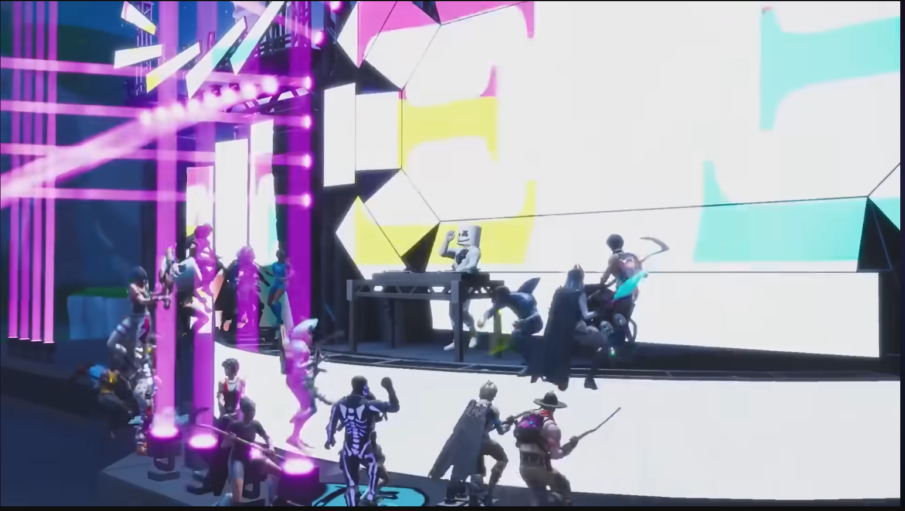

    

Like software, digital entertainment is infinitely reproducible (for free); however, unlike software, it is easily substitutable (replaceable). This has grave impacts for artists, making the demand curve much slipperier. Here is my amateur economic analysis for why the economic situation for creatives sucks so much right now.\*  

The reason software can make lots of money is because it's free for the seller to reproduce; however, for the consumer it is not easily substitutable. While there is some competition — for example, you might be able to replace Photoshop with GIMP — your substitution options are limited in most cases. If we contrast this with digital entertainment (YouTube videos, books, songs, anything that you can put on a computer), we see that, like software, it is infinitely reproducible; however, it is also very easy to substitute. When I log on to YouTube more often than not, I'm not looking for a specific creator; I just want some slop to fill my brain. The reproducibility then only hurts creators, as it reduces the product's value in the eyes of the consumer. From the consumer's POV, one extra view doesn't cost the creator anything, so "should be free." I am reminded of this tweet which went semi-viral a couple years ago. 

    

We can try to encourage viewers to patronize the arts through donations and subscriptions, but these come with inevitable trade-offs and problems. A business model which relies on charity is probably going to be risky, and most creators are going to be hesitant to paywall their best content since that is how they attract new fans. So the Patreon business model remains in this weird charity limbo and is very vulnerable to economic shocks or cost-of-living spikes when people cancel their subscriptions. You may have noticed a number of YouTubers this year admit that they are in difficult economic circumstances. 

Live performers, I think, manage to sidestep this problem because of their costly reproducibility. People complain about the price of concert tickets, but they absolutely buy them. Live theatre tickets are expensive, I think, because in the eyes of the consumer these performances are a limited resource and, therefore, deserve the price.

While artists are rarely rich as a cohort throughout history, I suspect this problem went into hyperdrive around the emergence of broadcast television and radio (I spoke about this in my [broadcast media blog post]). Broadcast operators realized quickly that there is no way to force people to pay for their TV. That's what broadcast means. It's in the air. Suddenly with TV and radio, the viewers no longer took up space in the performers' venue, and while this means a performer can share their work much further, it became more and more difficult to convince anyone to actually pay for it. As [Hank Green pointed out in a unrelated but excellent video](https://www.youtube.com/watch?v=d8PndpFPL8g), the invention of the radio was likely the first time in human history where you could listen to music without the musician physically being in the room with you. 

Anyway, that is how we ended up with the situation where the primary economic function of the arts is to sell ads.

The other attempt at fixing the economic problem is through attempts at artificial scarcity. If we just get rid of the infinitely reproducible bit, we can increase the value in the eyes of the consumer. We saw this attempted unsuccessfully with the NFT trend, but largely successfully with "limited edition digital cosmetics" in video games. Personally, I am not a huge fan of artificial scarcity in any form, perhaps because I have never seen an implementation which was not overtly predatory. However, you cannot say it is not sometimes effective. 

One strange compromise which I noticed pop up amongst musicians during the COVID years was "digital live concerts", where a few of the smaller musicians in my area were selling tickets to streamed sets. Unfortunately I never attended any of these at the time, but one of my friends who did really enjoy the experience. According to him, "it was really personal." I think this contrasts with the soulless and impersonal attempts to scale this idea we saw with Fortnite's "digital concerts" with DJ Marshmello and the like. [Dan Olson from Folding Ideas discussed these events](https://www.youtube.com/watch?v=dPHPNgIihR0), which were **not** live but just a pre-recorded set piece that limited the audience to 60 per server. 

If we are being frank, this is pretty cringe, right? It's just a cross-promotional ad embedded in an overmonetized hellhole of a "platform." If I were to try and analyse the difference between this and [Hannah Wood](https://open.spotify.com/artist/3AQzP7qvjxRmj5ySXnYmLb)'s bedroom set, I think the small and intimate nature is important, where the creator was interacting with the audience. Are musicians all going to become streamers now? [Internet Shaquille](https://www.youtube.com/watch?v=oJJXrf8Uhwc) thinks we are on the verge of a Renaissance of DJs, largely driven by DJ streamers.  

I would love to conclude my blog-post with solutions to all the problems I think are worth writing about, but unfortunately I do not have the solution to everything. Getting artists paid is a really sticky problem when analysed from a supply/demand perspective. A certain kind of socialist might argue that this is another example of market failure, and while their diagnosis may be correct, I am not sure what we can do about the problem while we await the arrival of fully automated gay space communism. Oh well, if you are reading this, go buy your struggling broke artist friend a sandwich or something. 

---

> \* **Writer's Note:** I am not an economist, and I am not a "digital creator"; I am just a guy who reads a lot of books and thinks about things. 
>
>If I am wrong about my economics or my understanding of the creator economy, feel free to publicly flame me in the comments or email me from my contact page. I don't do any tracking on this website, so the occasional email is a nice way to know if anyone actually reads it. 

---