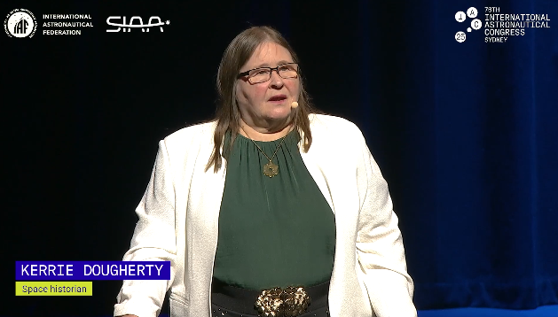
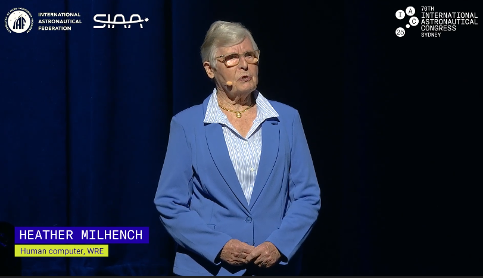
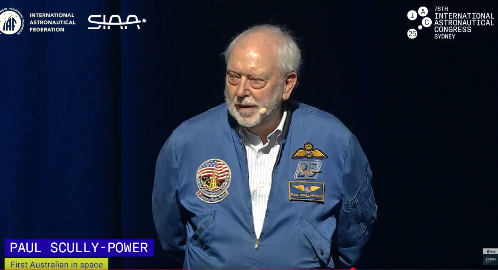
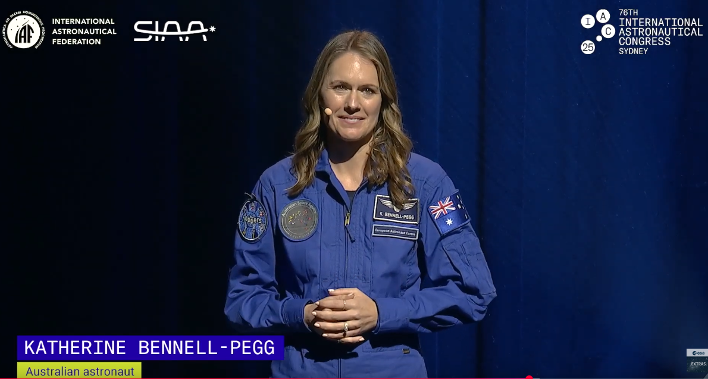
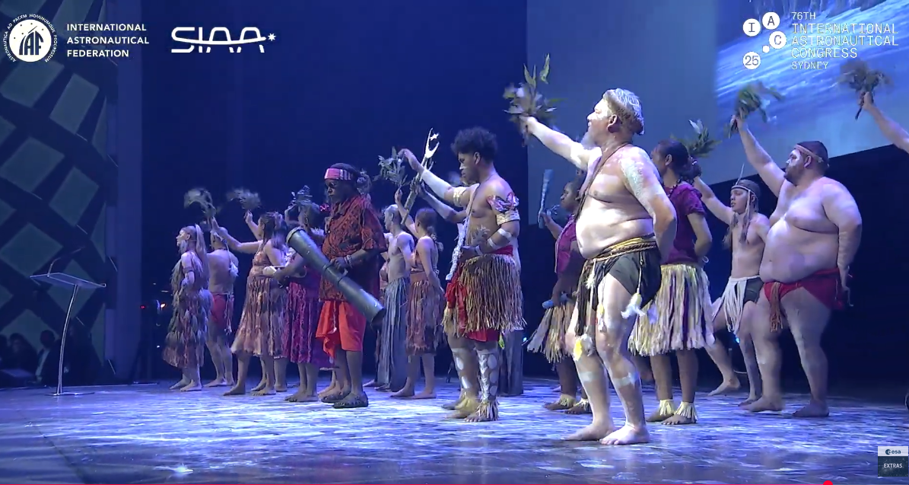
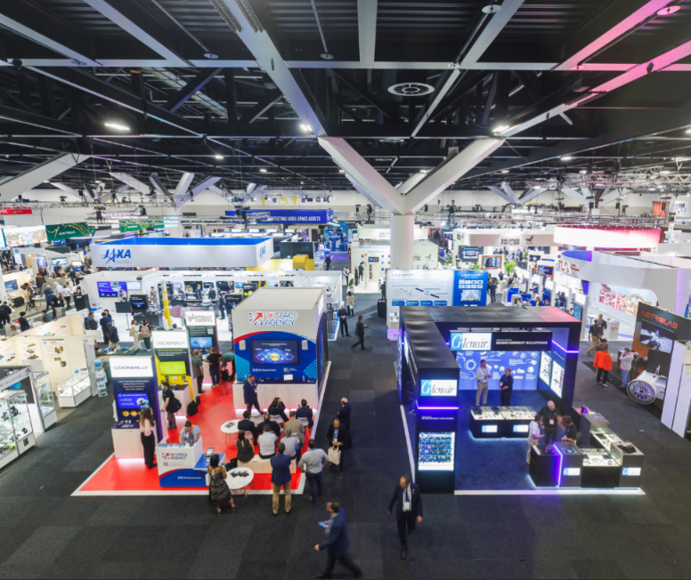

I attended IAC 2025 last week in my home city of beautiful Sydney!

I figured I would publish some of my notes from the week. Apologies for not posting any photos of the event. It never occurs to me to photograph the random things I see, and I don't like photographing strangers. 

##  General Thoughts

The theme of this IAC was *"Sustainable Space; Resilient Earth"*. The theme ends up being quite broad, by design likely. 

On one hand, it shows that people are beginning to really take space congestion and the risk of [Kessler syndrome](https://en.wikipedia.org/wiki/Kessler_syndrome) seriously. However to my mind, the term "sustainable" highlighted the undercurrent of economic anxiety shared by many in the space industry at the moment. With fears of recession, or possibly even [stagflation](https://www.investopedia.com/terms/s/stagflation.asp) most people understand that space technology is likely to be viewed as an expensive luxury to the general public. This is no surprise considering the very public behaviour of certain winners of the [IAF World Space award in 2025 and 2023](https://www.iafastro.org/activities/honours-and-awards/iaf-world-space-award/). This is where the second half of the refrain, "Resilient Earth" is so important in my opinion. With climate change already locked in to some degree, increased climate and weather monitoring is key to preparing for and responding to natural disasters. For this reason, Earth observation work, from [bushfire monitoring](https://researchportalplus.anu.edu.au/en/publications/ozfuel-a-space-based-vegetation-fuel-flammability-monitoring-syst) to [algal bloom tracking](https://www.csiro.au/en/news/all/articles/2017/september/algal-blooms) received a lot of attention at this IAC. 

My interest in the theme was largely around the understanding of the RF spectrum as a limited resource in space. It is no secret that this is a motivating factor for [my research](https://caffeineandlasers.com/blogs/phdAt5Levels), and people are really starting to work on ways of addressing this. As well as my booth, there were a few other groups presenting wither research or products built around laser communication in order to get around RF congestion and down-link more data. Instead of increasing downlink **supply** like us, others were promoting products and techniques to reduce RF **demand**, *i.e. sending less bits back down to Earth*. This was usually some kind of data compression, or edge processing performed on the spacecraft itself. Unsurprisingly, there were a number of people promoting "AI in space", in each case that I saw, the application of ai in space was to get around RF congestion or avaliability. This sometimes meant, prioritising which data to download, autonomous driving, or finally, just a re-branding of compression algorithms. 

## The Opening Ceremony

The opening ceremony was packed, my group was lucky enough to grab the last few seats, but a few others we spoke to didn't make it, and had to watch the live-stream from another room. The highlights in my opinion were  the segments of Australian Space History collated and presented by Kerrie Dougherty

The ceremony featured both archive footage from history as well as personal addresses from some key people from our space history. The highlites were Helen Milhennch, who worked as a human computer in the 1960s,

as well as Paul Scully-Power the first Australian born astronaut to visit space (and who whose jokes got the biggest laugh of the event), and Katherine Bennell-Pegg the first Australian qualified astronaut to represent the Australian Flag.

The ceremony also featured addresses from a few politicians which were as interesting as you would expect, and a few intermissions with dance perfromances from several Aboriginal and one Torres Straight Islander Groups.

Finally, I can't finish talking about the opening event without mentioning the award ceremony. The IAF presented the World Space Award for  *"an outstanding contribution or contributions in space science, space technology, space medicine, space law or space management of exceptional impact to the world’s progress in astronautics"* and this years individual award went to Jeff Bezos, who did not even show up for the award. Instead one of the seniors of Blue Origin (who presumably actually did some of the work) to accept it on his behalf. The award ceremoney ended with some comments from the current IAF president "Those awards are a reminder of what is possible when vision, determination and collaboration come together"..... Your boss can win an award for funding your work. 

The opening ceremony can be watched on YouTube [here](https://www.youtube.com/watch?v=RiuPGq3qDXs) if you are interested.
##  The Talks
Obviously there were a lot of talks, and I did not go to the majority of them. I focused mainly on the talks which featured optics and lasercoms. I did make an effort to pop in to one of the SETI talks however.

Thematically, there is not a lot I can say about the talks. Space technology is a growing sector, with lots of work going into increasing the precision and decreasing the size, weight and power of the payloads. Of the Eath observation talks I watched, some of the interesting concepts I saw were Japanese attempts at early warning systems for [earthquakes from changes in the Earths magnetic field as measured from space](https://iafastro.directory/iac/paper/id/99443/abstract-pdf/IAC-25,B1,3,8,x99443.brief.pdf?2025-03-28.12:46:28), and [Polish Attempts to measure and predict space weather](https://iafastro.directory/iac/paper/id/96943/abstract-pdf/IAC-25,B1,3,7,x96943.brief.pdf?2025-03-28.12:45:40), as well as the bushfire hazard prediciton and algal bloom management I mentioned earlier. 

Of the laser talks I watched, a common concern was the ongoing frustration was the lack of space laser terminals to test against. The industry is in a frustrating bind at the moment, where no one wants to launch laser terminals until the technology is sufficiently proven, but it is very difficult to operationally prove it without partners in space. Ultimately, I think this problem is temporary, especially with [Optical2Orion](https://www.nasa.gov/directorates/somd/space-communications-navigation-program/nasa-laser-communications-terminal-delivered-for-artemis-ii-moon-mission/) going on the Artemis missions, I think satellite operators are going to come around soon.

## The Floor

The exhibition floor was massive, I got lost more than once trying to remember where things were. It was great to see Australia so strongly represented, NSW, Canberra, South Australia and Western Australia all had their own pavilions, and several other Aussie companies like Advanced Navigation also had their own booths. 

I won't get too into it here, since most of what I did on the exhibition floor was networking, and meeting people. I will say I had plenty of good chats and it is exciting to see a growing space industry. 

One funny moment I have to share was the when we went to the NASA booth for a presentation they were scheduled to give. A few minutes after the talk was scheduled to start a representative came around and apologised saying it was rescheduled. We all checked the news on our phone and sure enough, the deadline passed for Congress in the U.S. and their government had just shut down. Not sure if that was a coincidence. 

Each day there was some booth handing out food or drinks, which made for a lively event. Plenty of pins, stickers, totebags, random 3D printed bullshit and other merch handed out liberally. 

The public "Space Day" on the final day of the conference was absolutely chokkas. According to IAC they had 10,000 tickets sold.  I am sure that the public had a good time, and it was probably the most important day for some of the outreach folk at the Australian Space Agency and such, but by that point I was exhausted and went home early. It was a powerful reminder to be grateful however, seeing others treat your career as their exciting day out. 

## Conclusions

This years IAC was a blast. Well worth the time (as long as you can swing your institutionto pay for the tickets).