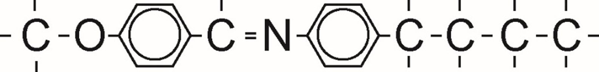
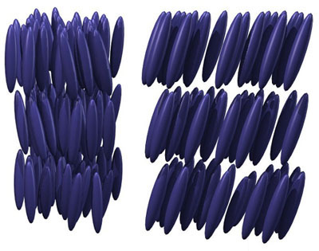

From my time at Finisar I got to work extensively with **L**iquid
**C**rystal **o**n **S**ilicon (LCOS), **S**patial **L**ight
**M**odulators (SLMs). This page is my attempt to share a little of what
I\'ve learned, because it is such a cool technology that I hope others
get to work with.

# 1 What is an LCOS SLM?

There are two acronyms here, so I will break it down into its composite
parts before I piece everything back together.

## 1.1 Liquid Crystals

We all know that liquids are substances without any structure, the
molecules are free to move around, and don\'t have any structure. A
crystal on the other hand, has a lot of structure, it is a substance
with a structure that repeats in one, two or three dimensions (or four
if you count [time crystals](https://en.wikipedia.org/wiki/Time_crystal)
). Bringing the two concepts together, liquid crystals are a substance
with a loosely repeating structure, where molecules are free to jostle,
twist, and rotate, but not break out of their structure.

The molecular structure of the liquid crystals we are interested in
gives it another trick that makes it useful for our applications. If we
consider the MBBA molecule:

It has a long rod-like structure, AND a free electron that is able to
move up and down the length of the molecule uninterrupted. This electron
makes the substance both electrically and optically active.

Putting all this together, liquid crystals are long, rod shaped
molecules who arrange themselves in a repeating lattice with both
electrical and optical responses.

### 1.2.1 Electrical Properties of Liquid Crystals {#electrical-properties}

As a result of that free electron, when we expose a liquid crystal
lattice to an electric field, the molecules will rotate, re-orienting
themselves to point in the same direction of the electric field. This
means that by applying a voltage, we can control the axis or the
direction of our liquid crystal.

### 1.2.2 Optical Properties of Liquid Crystals {#optical-properties}

That free electron also affects the optical properties of the light.
This is because light is an electro-magnetic field, so the free electron
will oscillate in harmony with the electric field of any light that
passes through it, this slows down the speed of light through the
substance. There is a catch though, that electron can only run up and
down the length of the molecule, so if the molecule is not totally in
the same axis as the electric field of the light, the effect will be
reduced. That means that the refractive index of the substance (the
speed which light moves through it), is determined by the the angle the
light hits the crystal at.

This is important, because slowing down light is how we bend it. Imagine
when you are driving a car, and your left tyre is slowed by a puddle,
making you veer left. When light hits a slow patch at an angle it bends.
This is how lenses (like the ones in your glasses works.)

## 1.2 Silicon

Now that we have gotten liquid crystals out of the way, lets talk about
silicon technology. Undoubtedly computers have changed the world, but
convenient side effect for us that work in optics, is that the computer
revolution has resulted in cheap, high quality semiconductor
manufacturing. So any time we can exploit silicon technology for optics,
we jump on the opportunity.

In order to control those liquid crystals I described above, we sandwich
the liquid crystal between a silicon chip and a conductive transparent
top glass. The silicon chip lets us apply a custom voltage anywhere in
the x-y plane. That is, we can create an arbitrary electric field
pattern across the liquid crystal.

# 2 Putting it all together {#putting-together-the-first-word}

After all that, we are ready to understand what the device does. An LCoS
is a device that allows you to apply any refractive index profile you
want in an x-y plane. It does this by creating an arbitrary electric
field profile using silicon chip technology, and placing liquid crystals
within that field, whose refractive index is a function electric field
strength. This contraption allows you modulate the phase of incoming
light in space. This is why we call them a **Spatial Light Modulator**.

In simple English. This is a lens, that we can reshape into any optical
configuration from a computer.

# 3 Applications

There are a surprising number of applications for LCOS SLMs, from Beam
Steering, to [photographing through walls and around
corners](https://arxiv.org/abs/1202.2078), but I want to talk about
digital holography for now.

## 3.1 Digital Holography

Using spatial light phase modulation, we can use an SLM to create a real
life holograms. The required necessary phase map to create a given
hologram\'s amplitude map can be calculated using the Gerchburg Saxton
Algorithm.

This algorithm creates a phase profile, which when light propagates
through, creates constructive interference at the desired points in 3D
space, and deconstructively interferes everywhere else.

Below you can see a hologram I built in the lab. The photo fails to do
it justice. If I were to move the box forward or backwards, the hologram
would disappear, since it was programmed to appear at that specific
point in space. It would have worked better if I had a smoke machine on
hand.

### 3.1.1 Holographic Optical Tweezers

Aside from cool sci-fi implications of real life holograms replacing
zoom calls, I would like to highlight one especially cool application of
Computer Generated Holograms and LCOS SLMs, and that is Optical
Tweezers. This effect relies on the fact that light has momentum. By
exploiting this fact, we can use CGH to create a donut shaped light
intensity profile, and use the momentum contained within this profile to
pick up and move around small objects. This is super useful for things
like neuron cells, which tend to respond poorly to being picked up by
glass pipettes. Holographic Optical Tweezers offer a comparatively
gentle experience for the cells. This concept is used with some
regularity within biological research and is a commercial product
offered by [Meadowlark Polarisation
Optics](https://www.meadowlark.com/3d-holographic-optical-tweezing-kit/).
You can see a demonstration below, where particles only 4.5 micrometers
are being manipluated by such a device. 

## 3.2 Spy Stuff

It turn out, the only difference between white paint and a mirror, is
that white paint isn\'t very smooth. It reflects all the colours the
same as a mirror, but scatters the light - reflecting it at different
angles and distances.

This is where the LCOS comes in again, if the light has been scattered
by the white paint, we can use an LCOS to undo that distortion, and
reconstruct an image. This is what [these
researchers](https://arxiv.org/abs/1202.2078) figured out, where they
were able to take photos around corners by photographing white paint,
and through \"privacy\" glass.  Credit: [Katz, O.
(2012)](https://arxiv.org/abs/1202.2078)

# 4 Conclusion

I hope you enjoyed this short introduction to my niche area of interest.
There are plenty of cool applications for LCoS in the world of research
and engineering, and if you ever get the chance to work with the, I
would highly recommend it.
