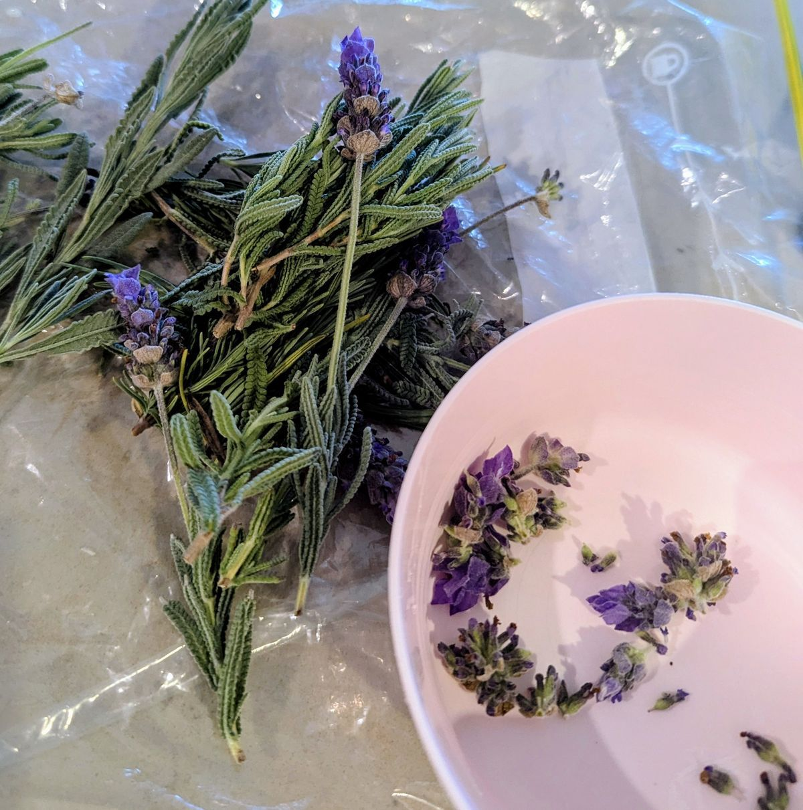
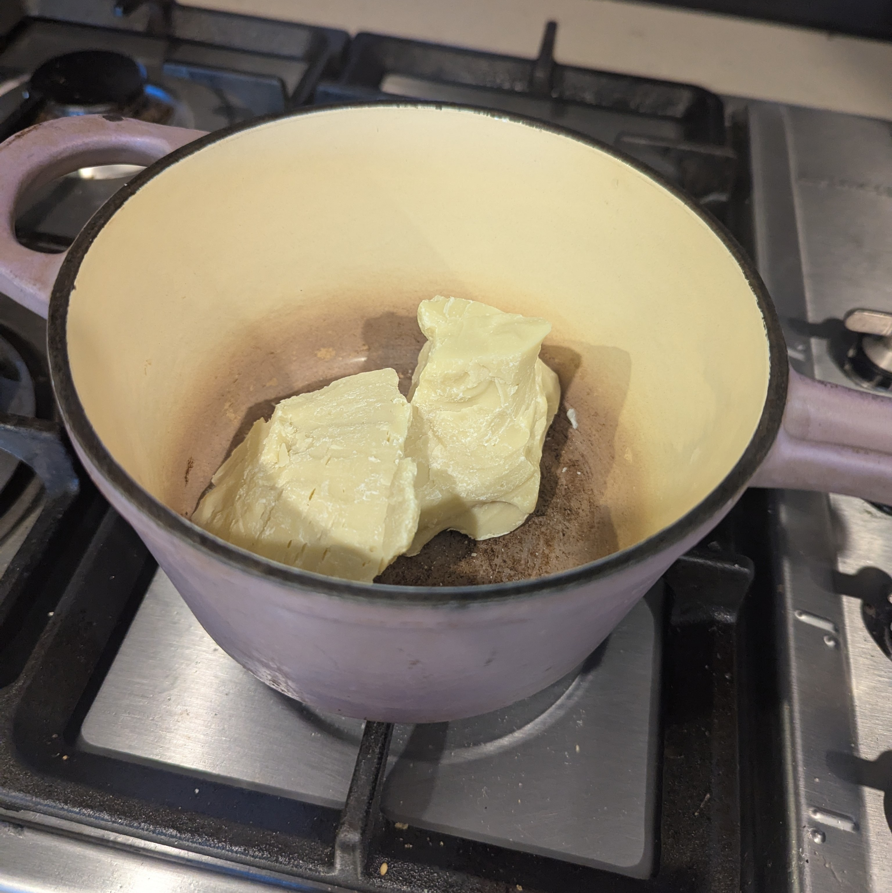
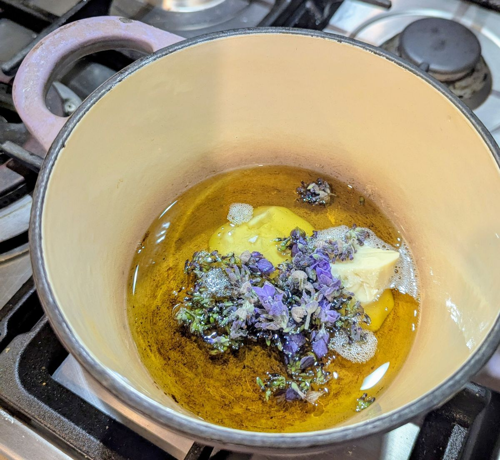
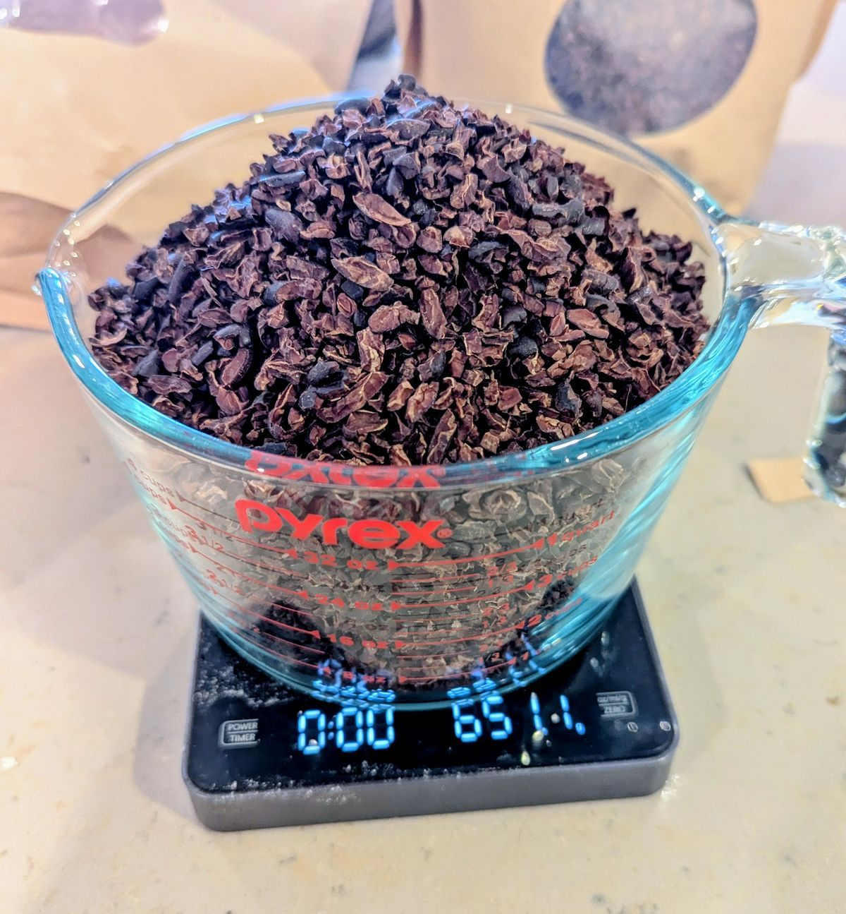
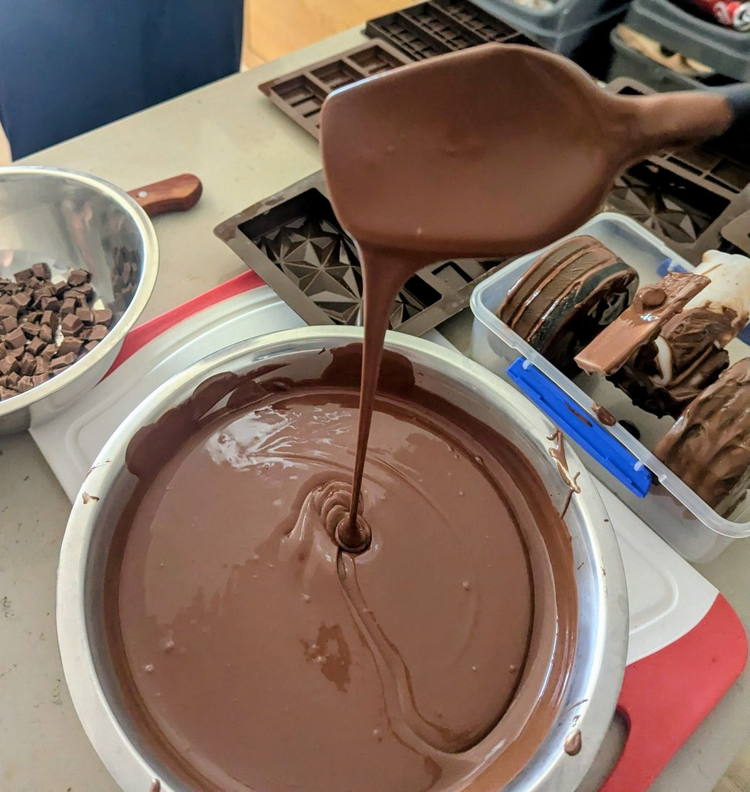

  <a href="#recipe-card" style="background: var(--color-primary-purple); color: var(--color-bg-dark); padding: 0.75rem 1.5rem; border-radius: 6px; text-decoration: none; font-weight: 600; display: inline-block;">
    🍫 Jump to Recipe
  </a>

## The Intro

I recently got my hands on a [melanger](https://en.wikipedia.org/wiki/Melanger) and have been trying my hand at chocolate making. Only after starting this hobby, I found out that there are very few sources on the internet for home-scale chocolate making. Thankfully, we have [The Chocolate Alchemist](https://chocolatealchemy.com/), whose giant shoulders I can stand on as I learn how this process works. However, with such a lack of knowledge on the internet, I figure this is my chance to add to the Internet's knowledge base.

An unsaturated niche on the internet is a rare find and quite exciting when you have the chance to help fill it!

This blog post follows my second-ever batch of chocolate, a Lavender and Vanilla infused 45% Dark Milk chocolate, inspired by [Safiya Nygaard's video](https://www.youtube.com/watch?v=bA6-VEVAzCE) and adapted from [The Chocolate Alchemist's Dark Milk Chocolate Recipe](https://chocolatealchemy.com/recipes/dark-milk-chocolate-45).

## Making The Chocolate

Information on infused cocoa for chocolate making on the internet is pretty scant. So in this case, I was going totally on gut feeling. To flavor the chocolate, I reserved one-third of the cocoa butter for infusion, tossing the rest straight into the melanger. 

For the flavoring, I took 3g of fresh lavender that I harvested from ~~the local council gardens~~ my garden, using just the purple flowers. I heated the cocoa butter in a small saucepan, added the lavender, and continued heating until it started bubbling. While this cooked the lavender to some degree and probably evaporated some of the flavors prematurely, I wanted to make sure I drove off the moisture early since chocolate cannot contain any moisture whatsoever. Once I turned off the heat, I added a glob of vanilla paste. I then allowed the whole thing to cool and let it rest until the rest of the chocolate was ready, re-melting it every now and then to maximize the infusion strength. 

  
  
  

*Note:* I used vanilla paste here since I didn't want to include any ethanol you would get from essence. Unfortunately, the glycerin that the vanilla is suspended in did not effectively emulsify in the cocoa butter. I would have been better off just buying vanilla for this application, I think. Lesson for the future!

As for the rest of the process, I followed the process set out by the Chocolate Alchemist more or less straightforwardly. 

I get my cocoa as roasted nibs from South Pacific Cocoa. These are the *only* local supplier in Sydney (that I know of), but I am really happy with their product quality. Anyway, in case you were wondering what cocoa nibs look like, they look like this! 

  

I add these nibs, the remaining 300g of cocoa butter, 450g of milk powder (yep, as in powdered milk), and 900g of sugar to my melanger (grinder). I ground it for about 56 hours this time. This was longer than the time set out by the Alchemist, but I found it took the texture from Cadbury at 16 hours to Lindt at 48 to something else entirely at 56 hours. I imagine it depends somewhat on the cocoa you use. 

To give an idea of the process, this is what the grinder looks like for the first few minutes as I add the nibs bit by bit. After grinding and for a while I strained the infused butter and added it to the mix. At this point the chocolate looked like this! Ready to temper:

  
  

For the tempering, I ended up using a 100g block of Cadbury milk chocolate to seed the crystal formation. While incorporating Cadbury is definitely a bruise to my ego, I don't own any silk, don't have any previous batches to seed with, and don't trust myself to do it without a seed. So I swallowed my ego and used store-bought. 

Finally, we bought holographic chocolate molds for this batch, and they turned out so pretty!

## The Results

The tempered chocolate was so smooth, and it retained the holographic diffraction grating really well. The flavor profile was amazing. The floral aroma of the lavender is familiar in concept but new in form (or at least I have never tasted lavender chocolate before). The nibs I get from South Pacific Cocoa are very high quality. Even when prepared as a dark chocolate (which was my last batch with them), they taste bright and fruity, so it is just a fantastic pairing with the floral profile of this chocolate.

  
  

(Try to ignore the fat fingerprint on that one lol)

The strength of the butter was a real emotional roller coaster for me. I grabbed about as much lavender from the garden as I felt comfortable cutting off in public. A lot of the shrubs were quite dry as well, so I didn't want to take too many when the shrubs were so sad-looking. Anyway, after the initial heating, I gave it a smell and was worried that it wasn't strong enough, and this worry continued all the way until I added it to the molten chocolate. Tasting the molten chocolate afterward, it definitely tasted like lavender, but it was really mild. By the time it cooled, the scent profile changed quite drastically. The lavender comes through very strongly in the final product; if anything, it needed more vanilla to balance the floral profile. 

Anyway, very happy with the result. These will form the basis for all my gifting for the next month or so. 

# Recipe Card:

  

    <h3 style="border-bottom: 2px solid var(--color-primary-purple); padding-bottom: 0.5rem; color: var(--color-primary-purple); margin-top: 0; font-size: 1.2rem;">Ingredients</h3>
    <table style="width: 100%; border-collapse: collapse; margin-top: 1rem; color: var(--color-text-body);">
      <tbody>
        <tr style="border-bottom: 1px solid var(--ctp-surface1);">
          <td style="padding: 12px 8px 12px 0; font-weight: 600; color: var(--ctp-lavender); font-size: 0.95rem;">680g</td>
          <td style="padding: 12px 8px; font-size: 0.95rem;">Cocoa Nibs</td>
        </tr>
        <tr style="border-bottom: 1px solid var(--ctp-surface1);">
          <td style="padding: 12px 8px 12px 0; font-weight: 600; color: var(--ctp-lavender); font-size: 0.95rem;">450g</td>
          <td style="padding: 12px 8px; font-size: 0.95rem;">Cocoa Butter</td>
        </tr>
        <tr style="border-bottom: 1px solid var(--ctp-surface1);">
          <td style="padding: 12px 8px 12px 0; font-weight: 600; color: var(--ctp-lavender); font-size: 0.95rem;">450g</td>
          <td style="padding: 12px 8px; font-size: 0.95rem;">Milk Powder</td>
        </tr>
        <tr style="border-bottom: 1px solid var(--ctp-surface1);">
          <td style="padding: 12px 8px 12px 0; font-weight: 600; color: var(--ctp-lavender); font-size: 0.95rem;">900g</td>
          <td style="padding: 12px 8px; font-size: 0.95rem;">Sugar</td>
        </tr>
        <tr style="border-bottom: 1px solid var(--ctp-surface1);">
          <td style="padding: 12px 8px 12px 0; font-weight: 600; color: var(--ctp-lavender); font-size: 0.95rem;">3g</td>
          <td style="padding: 12px 8px; font-size: 0.95rem;">Fresh Lavender</td>
        </tr>
        <tr>
          <td style="padding: 12px 8px 12px 0; font-weight: 600; color: var(--ctp-lavender); font-size: 0.95rem;">4g</td>
          <td style="padding: 12px 8px; font-size: 0.95rem;">Vanilla Paste</td>
        </tr>
      </tbody>
    </table>
  

  
  

    <h3 style="border-bottom: 2px solid var(--color-primary-purple); padding-bottom: 0.5rem; color: var(--color-primary-purple); margin-top: 0; font-size: 1.2rem;">Process</h3>
    <ol style="margin-top: 1rem; padding-left: 1.5rem; line-height: 1.7; color: var(--color-text-body);">
      <li style="margin-bottom: 1rem;">
        <strong style="color: var(--ctp-lavender);">Prepare flavored cocoa butter:</strong> Reserve 300g of cocoa butter for grinding. Melt the remaining 150g in a small saucepan, and add the lavender. Continue heating until bubbling starts, then shut off heat. Add vanilla. Allow to infuse for a few days.
      </li>
      <li style="margin-bottom: 1rem;">
        <strong style="color: var(--ctp-lavender);">Grind the chocolate:</strong> Add all remaining ingredients to the melanger over the course of 30-40 minutes, then grind for two and a half days.
      </li>
      <li style="margin-bottom: 1rem;">
        <strong style="color: var(--ctp-lavender);">Add back the flavored butter:</strong> Re-melt the infused cocoa butter, strain out the flowers with a tea strainer, and add it to the melanger. Let it run for another few minutes to ensure it is fully mixed.
      </li>
      <li>
        <strong style="color: var(--ctp-lavender);">Temper the chocolate and mold it:</strong> This step is left as an exercise to the reader.
      </li>
    </ol>
  

