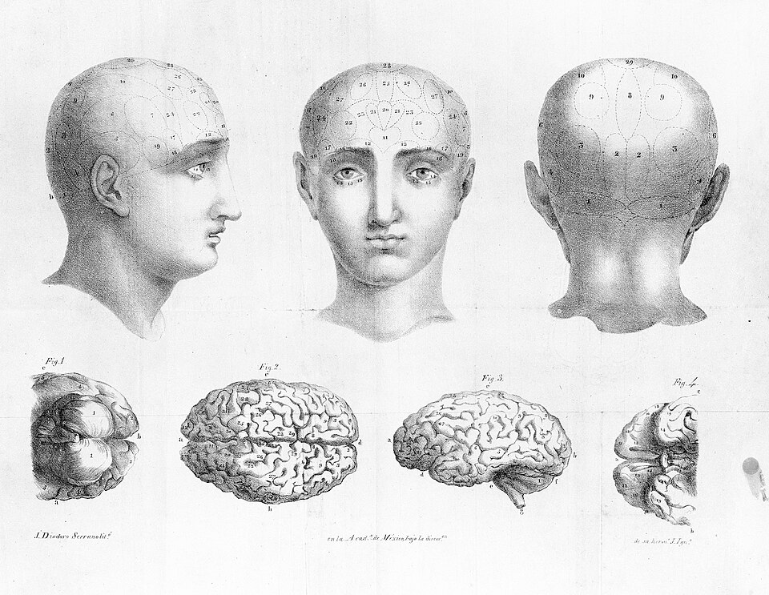

*The phrenology of a "math person"* 

Phrenology, 1834
**Credit:** [WikiMedia](https://commons.wikimedia.org/wiki/File:Phrenology,_1835_Wellcome_L0002999.jpg)

The theme of this month's 32BitCafe Web Carnivale is [Back To School](https://discourse.32bit.cafe/t/back-to-school-2026/5099). And I am here to teach you about mathematics.

In any other blogpost, this would be the point where I make a sarcastic joke about how it is everyone's favourite subject, or I would beg with you to stay with me and say that the maths isn't that difficult in order to make the reader feel comfortable. I won't be doing that in this post because the subject is important. 

<blockquote style="color: var(--color-primary-purple); font-size: 1.8rem; font-style: italic;">
	There is no such thing as a "math-person".
</blockquote>

I may be a physicist, but I am not a *math-person*, I am someone who practices maths for around 2,000 hours a year. So of course I am good at it. But more importantly than busting the math-person myth, I need to bust the myth of the not-a-math-person. Many people think they are a *not-a-math-person* and they freak out at the first mention of statistics, and think they will never understand it all.  If the *math-person* isn't real, I am here to tell you that the *not-a-math-person* is even more not real. 

This is important to me, because I think that the phrase, "not everyone is a math person", might be one of the most destructive phrases in education. It is totally unacceptable in my opinion and if you say it to a child you are not being kind, you are actively removing opportunities from their life.

In the Western world, we are comfortable with the understanding that *not-a-reading-person* is not a thing. This doesn't mean that reading is easy for every child to learn, some children will have trouble, and that's okay. We just give those children extra time and effort to make sure that they pick it up. We have decided as a society that illiteracy is a problem.

Yet somehow a significant portion of the population has decided that it is okay if people are innumerate. The rest of today's lesson is to convince you that you are not a *not-a-math-person*, and are just as capable of improving your mathematics as you are capable of improving your literacy. 

## but first, why you need to care about math

Believe it or not, self-help wasn't always grifters telling you to clean your room and start dropshipping temu crap. Its origins actually came from anarchist socialist workers' groups who formed "mutual improvement societies" where working class people came [together to teach and learn important skills including literacy and numeracy](https://www.youtube.com/watch?v=qMmgDeyhamI). This was important since a literate worker is harder to trick. They can read the contracts, catch the fine print and advocate for themselves in writing and courts. 

 It's also just as easy to take advantage of an innumerate person as it is to take advantage of an illiterate person. 

  
<strong>Another tangent on self-help</strong>

  
The concepts of mutual improvement societies extended into feminist circles. This included publications such as <a href="https://en.wikipedia.org/wiki/Our_Bodies,_Ourselves">Our Bodies, Ourselves</a> which offered frank advice on women's sexual health, pregnancy and sexuality. These groups reasonably identified that the male-controlled medical systems could not be sufficient without a female voice. This is barely relevant to my argument here, but I just think is really cool.

 
 Corporations are very happy to take advantage of the innumerate. And they pay people like me to do it. 

The predatory loans with high interest rates, complicated financial products with hidden fees, credit scores in general, all exist to siphon money away from the people who can't do the math, and towards those who can. 

Just as the only way to protect yourself from a bad contract is to be literate enough to read it, the only way to protect yourself from a bad deal is to be numerate enough to calculate the expected return and the risks.

## why I think you can do it

So now that I have convinced you that it is important, let me convince you that you are capable. Don't worry, I am not going to show you any fun maths (yet! Go look in the suggested reading list for that). Today's lesson is just to convince you that the next time is worth a try. We are going to talk about a *growth mindset*. 

In order to learn any mathematics, first you need to believe you CAN learn it.  Self-belief is a funny thing, so I don't want to overstate it, but I also don't want to understate it. Unfortunately, you can't do anything if you just put your mind to it. No matter how many Red Bulls I drink, I won't grow wings despite my belief. On the other hand, you absolutely CANNOT do anything you don't believe you can, so let's start there. 

So WHY do people conclude that they are a not-a-math-person? This decision is rarely made after a careful and logical assessment of all available information. It is a vague feeling you got in the classroom. This is why Carol Dweck (who pioneered a lot of the research into Growth Mindsets and limiting beliefs) suggests when we talk about [the power of "yet"](https://www.youtube.com/watch?v=hiiEeMN7vbQ&t=332s&pp=ygUMcG93ZXIgb2YgeWV0). You aren't bad at maths, you just don't understand it **yet**.

And this is really important, since maths is a cumulative process. So you don't get a reset like you do in other subjects like history where you can say "Oh I totally didn't understand the Ancient Egypt bits but I can lock in for the Roman Empire". Once you fall behind in maths, it takes learning every sub-step individually to catch up. 

And this is where I want to emphasize the importance of adaptability. This growth mindset business isn't about smiling smiling at a problem and manifesting a solution through vibes and manifestation. It is about acknowledging that mathematics is a solvable problem, and you just need to put in the effort to solve it. 

The ability to adapt, to find a solution to your problems, rather than shopping for a prebuilt solution is an incredibly important skill. Experts sometimes refer to this as "cognitive flexibility", and has an enormous impact on your ability to progress in almost any field. Even something as simple as videogames, which [this paper shows that cognitive flexibility is positively correlated with a player's skill in League of Legends with extremely high confidence](https://journals.sagepub.com/doi/10.1177/21582440221142728). The video which showed me this study was  "[Adaptability: How to rewire your brain for success](https://www.youtube.com/watch?v=n4A5eRNyMrE)" by HealthyGamerGG. That is a great video which goes into more depth on the art of adapting solutions to your circumstances. 

The only way to adapt is to become comfortable with being uncomfortable. This means that if you don't understand something you need to be confident in your ability to get there eventually. One of the funny things about STEM is everyone is almost always operating at the very top of their abilities, we all get stuck on mathematics *all the time!* The reason I get stuck on solving differential equations and not trigonometry is because I spent the hours getting stuck on trigonometry, and I have experience getting unstuck.  

In one of his greatest works ever, [Kidding](https://www.imdb.com/title/tt7375404/)—Jim Carrey tells his onscreen son a story about a story about mistakes:

<figure style="float: right; width: min(34%, 210px); margin: 0 0 1rem 1.25rem;">
  
</figure>

<blockquote style="color: var(--color-primary-purple); font-size: 1.2rem; font-style: italic;">
  “A plumber was applying for a job in a building… The building manager asked, ‘Have you ever made a mistake?’ And the plumber said, ‘Never.’ ‘Then how can I hire you?’ … ‘If you make a mistake, you won’t know how to fix it.’”
</blockquote>

Now the son doesn't quite get the point saying "Why would he need to know how to fix his mistakes if his whole thing is that he never makes mistakes", but of course, there is no such thing as someone who never makes mistakes. Or in mathematics, no such thing as someone who never gets stuck. All that exists are people who have practice getting unstuck. 

None of this is to say that maths is easy, and you can go learn how to solve differential equations tomorrow. Understanding requires effort. I just want you to know that you are capable of undertaking that effort. You can put in the time to learn the higher level concepts if you take the time to build your knowledge step by step, and become comfortable being uncomfortable. 

## Further Reading and Watching

- One of my favourite pieces of writing on the topic, and one of the inspirations for this post, was a video by Struthless - [How self-belief can make or break you](https://www.youtube.com/watch?v=k13gSzBzoAU) 
- As for actually learning maths in a fun way, here are a few of my favourites
	- [FractalKitty](fractalkitty.com) publishes fun mathematical artworks, I really liked this recent piece on [Hailstone Arabesques](https://www.fractalkitty.com/u/) 
	- 3Blue1Brown is my favourite mathematical YouTuber, his work is possibly less intuitive if you don't have a strong mathematical background, but the animation is gorgeous and he is a very good teacher. I have no hesitation in saying that he is personally to thank for me understanding [Fourier Transforms](https://www.youtube.com/watch?v=r6sGWTCMz2k&pp=0gcJCRoMAYcqIYzv) but [here is a fun one about Pi](https://www.youtube.com/watch?v=6dTyOl1fmDo&t=105s) ($\pi$)
	- Mathemusician [ViHart](https://vimeo.com/vihart) was another massive influence on my interest in math as a highschooler. She has recently taken down her YouTube channel, but her old videos live on in Vimeo.  I have [fond memories about this one about cool fractals](https://vimeo.com/147913562). Her videos are very watchable for a general audience.
	- Since it is 2026 and we have to talk about Transformers and AI, [WelchLabs](https://www.youtube.com/@WelchLabs) is one of the best sources to understand the Transformer architecture and its application in Large Language Models. [This one is my favourite](https://www.youtube.com/watch?v=qx7hirqgfuU&t=1902s) explanation of why adding even more dimensions helps us solve complex problems. 
	- [Laureen Leeks Substack](https://laurenleek.substack.com) is a great blog of data science applied to sociology. Wanna know why everything looks the same these days? [This essay has some answers](https://laurenleek.substack.com/p/temperature-zero-for-culture-why) (it's the algorithm's fault again)
	- [Numberphile](https://www.youtube.com/@numberphile) is another classic. Did you enjoy Good Will Hunting? Watch [this one](https://www.youtube.com/watch?v=iW_LkYiuTKE)

