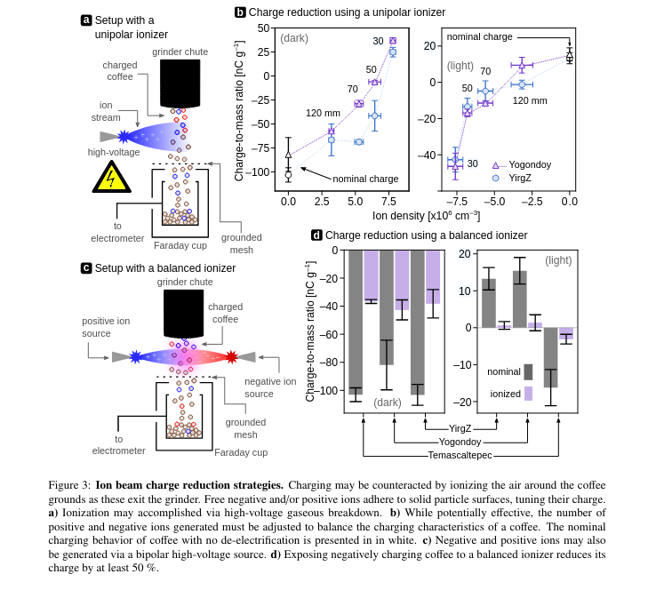
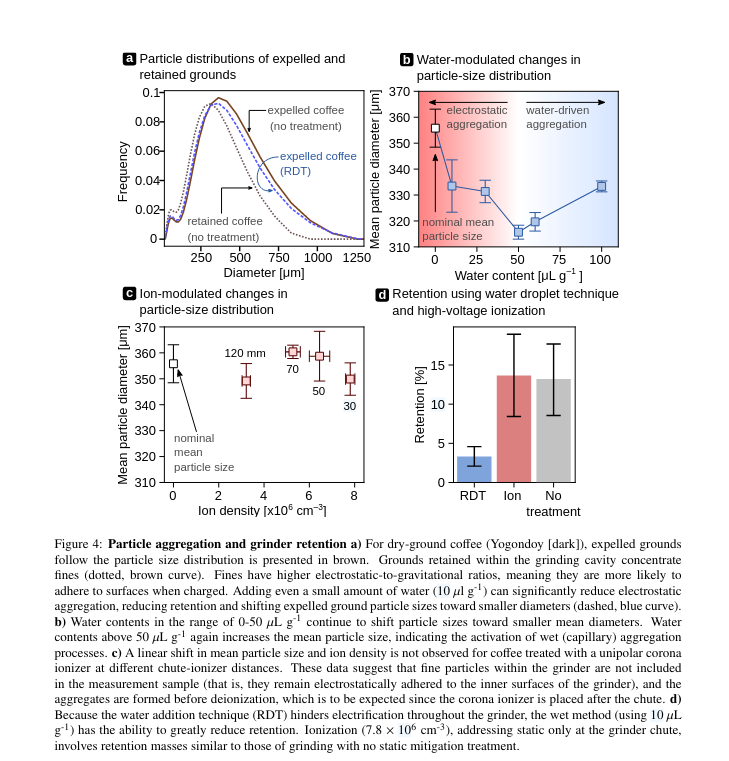
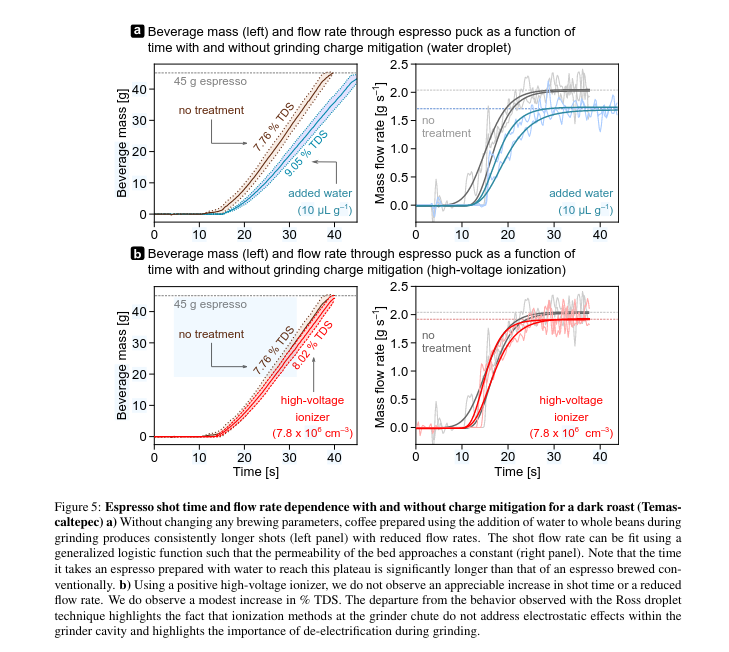
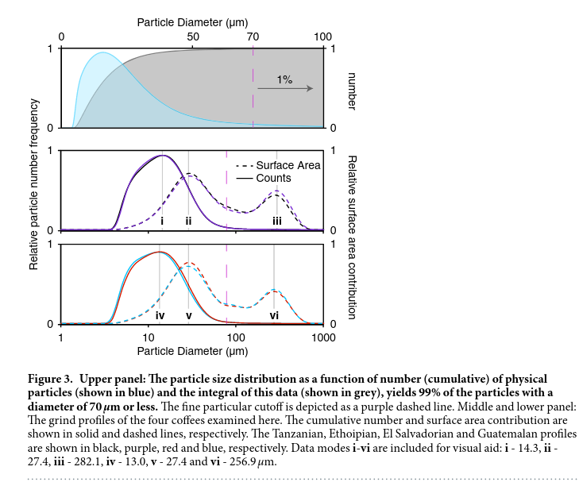
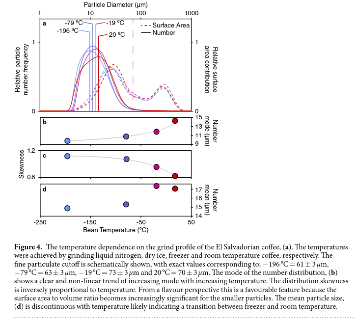

# Four Coffee Observations in Two Studies

There is something beautiful about scientists being given the freedom to
apply their skills to passion projects. High-impact science is valuable,
but the purity of studying a hobby out of sheer interest is something I
will always appreciate.

Here are four observations from two scientific papers on the practice of
coffee grinding. Experienced coffee nerds might know some of these
intuitively, but now we have graphs to back them up.

## 1. Study One: Chemical strategies to mitigate electrostatic charging during coffee grinding

One interesting aspect of coffee grinding is the role of electrostatic
charges. When you grind coffee, the particles become charged, causing
them to clump together and stick to the sides of the grinder. This can
be annoying, as it creates a mess on your coffee station, but it can
also significantly impact the quality of the coffee.

When coffee grounds clump together, water can't flow through them evenly
during brewing. This uneven extraction leads to what's known as
"channeling," where water finds the path of least resistance and flows
through only part of the coffee bed. The result is a cup of coffee
that's less flavorful and more bitter than it should be. This paper
quantifies two strategies used to minimize this effect.

### 1.1 Electrical De-ionizers

Many modern "luxury" grinders include high-voltage ionizers fitted on
the exit chute of the grinder. The idea behind this device is to bombard
the coffee grinds with charged particles, which neutralize any static
charge picked up during the grinding process.

The graphs shown in *d* and *b* demonstrate that fitting an electrical
de-ionizer does indeed reduce the charge buildup on the coffee grinds.

But this isn't the end of the story. Does this reduction in static
charge translate into a better cup of coffee? Observing the bottom
graphs in Figure 5 shows almost no difference between espresso prepared
with and without the de-ionizer. The researchers note that the flavor
difference is negligible as well.

How do we understand this result? The reason seems to be that by the
time the de-ionizer does its job, the damage has already been done---the
coffee grounds have already clumped together.

So while a de-ionizer might make your coffee station less messy, it's
not going to make your coffee taste better.

This raises an interesting question: Could combining a de-ionizer with a
grind distribution tool improve the situation? While de-ionizing the
coffee grinds does not cause the clumps to dissipate on their own,
perhaps it can make them easier to break apart with a coffee
distribution tool?

### 1.2 Spritzing the beans with water.

Another method for reducing static is much simpler: just spritz your
coffee beans with a little water before grinding. The idea is that the
water will dissipate charge as soon as it builds up. This method is much
lower-tech than the solution described above, but how does it compare?

The researchers measured a reduction in static charge when a small
amount of water was added to the coffee before grinding. It also
resulted in lower retention (i.e., how much coffee gets stuck in the
grinder) and reduces the grind coarseness, and increases grind
uniformity.

So how does this affect taste? The study observed that the addition of
water leads to a slower flow rate during brewing, which results in a
more concentrated extraction---especially with darker roasts. This is
also illustrated in figure 5.

### 1.3 Lessons from this paper

-   Grinders fitted with an electrical de-ionizer do not produce better
    coffee but do result in less mess when making coffee.\
-   Treating beans with a spray of water reduces clumping, resulting in
    increased extraction and lower grinder retention.

## 2. Study Two: The effect of bean origin and temperature on grinding roasted coffee

The second study focused on how different factors related to the coffee
beans themselves affect grinding

This paper compares the effects of both bean origin and bean temperature
prior to grinding.

### 2.1 The Effect of Bean Origin

Will different single-origin coffees grind differently? For once, the
answer is simple: NO!

It appears that between different coffees, the grind distribution
produced by the EK43 commercial are near identical for all of them.

1.  Four speciality grade coffees were ground to study grind profile
    variations.
2.  Grind profiles showed a skewed-Gaussian shape with particle sizes
    ranging from 0.1 μm to 1000 μm.
3.  All coffees had similar grind distributions, with minor differences
    in number modes and fine particulates cutoff.

There are a couple things to note here: - All 4 coffees tested were
light/medium roast - This test was only done on an EK43 grinder

There are a couple of things to note here:\
- All four coffees tested were light/medium roast.\
- This test was only done on an EK43 grinder.

This raises a few questions about the generalization of the study:\
1. Do darker roasts have the same particle size distribution as light
roasts?\
2. If not:\
- Are they self-consistent, like the lighter ones are?\
3. The EK43 is an expensive commercial grinder. How consistent are
cheaper home grinders?

### 2.2 Effect of Bean Temperature

If you've ever ordered one of those expensive coffees---like the ones
that cost more than \$10 a cup---you may have seen the barista pull the
coffee out of a freezer. The reason for this is obvious: they want to
keep the good stuff fresh for as long as possible. These baristas tend
to develop an intuition that freezing the beans makes them "shatter"
more evenly. So how accurate is their intuition?

It turns out it's quite accurate!

The paper's analysis shows that decreasing the temperature of the beans,
all the way down to -196°C, decreases both the average size of each
particle and reduces the "spread" of coffee grind sizes.

The intuition of shattering beans turns out to be an accurate
description of what is happening here. While there are (almost) no ice
crystals within the bean to shatter, the bean itself has a crystalline
structure sensitive to temperature. So chilling the beans really does
cause them to shatter when you hit them.

However, there are some caveats. As the beans pass through the grinder,
they warm up due to friction and contact with hot grinder blades. This
causes diminishing returns both as the coffee gets colder and as the
grinder is set finer.

Interestingly, this effect seems to be reversible. Coffee that's cooled
to extremely low temperatures and then warmed back up to room
temperature behaves just like coffee that was never cooled in the first
place.

# 3. So what did we learn?

The actionable takeaways from this mini deep dive are:

1.  Adding water to your coffee pre-grind improves extraction, reduces
    retention, and slightly decreases coarseness.\
2.  Freezing coffee increases grind size uniformity.\
3.  The electrical de-ionizer on expensive grinders helps reduce mess
    but does not appear to improve your coffee's quality (although
    combining de-ionization with distribution tools has not been
    studied).\
4.  Different coffees will have similar grind profiles on the same
    grinder with identical settings.

If you know of any novel research on coffee, let me know! My email is in
the "Contact Me" section of my website, and my Mastodon handle is on the
sidebar.

# 3 Sources

Harper, J.M., Hendon, C.H., 2023. Chemical strategies to mitigate
electrostatic charging during coffee grinding.
<https://doi.org/10.48550/arXiv.2312.03103>

Uman, E., Colonna-Dashwood, M., Colonna-Dashwood, L., Perger, M., Klatt,
C., Leighton, S., Miller, B., Butler, K.T., Melot, B.C., Speirs, R.W.,
Hendon, C.H., 2016. The effect of bean origin and temperature on
grinding roasted coffee. Sci Rep 6, 24483.
<https://doi.org/10.1038/srep24483>
