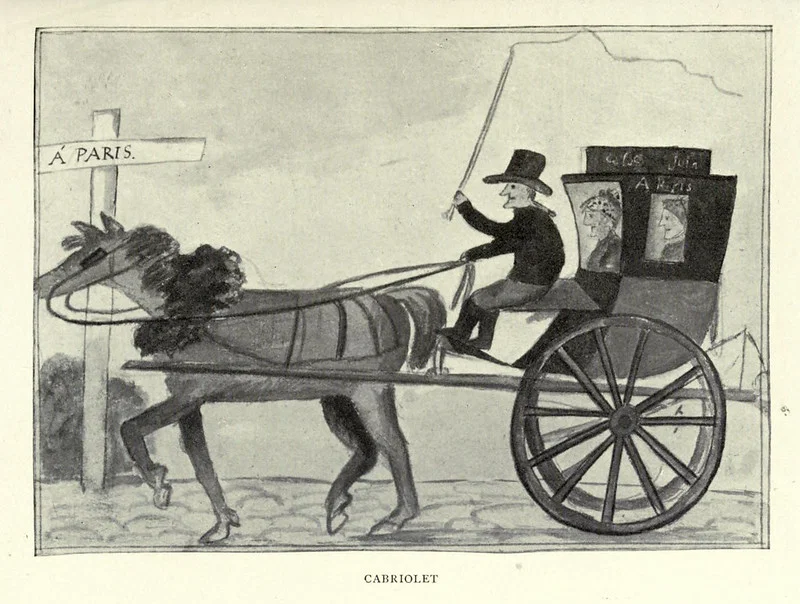
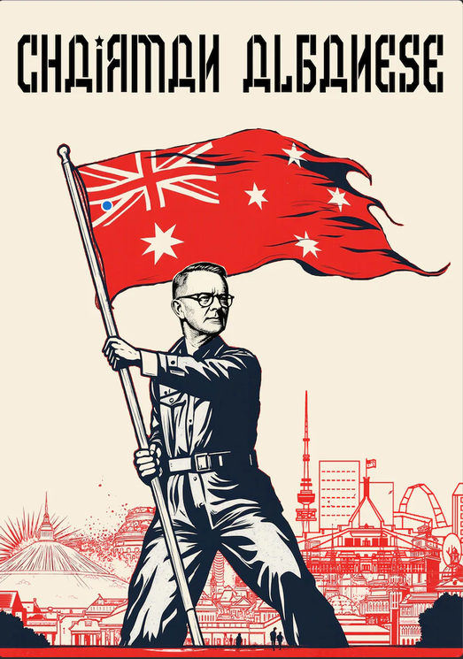

<em>I do not think that it does. At least not necessarily.</em>

Lets not put the cart before the horse here. In truth: The long arc of history veers towards winners, so the real question is.... why does it look like progressives keep winning in the long run? 

  

    
  

  

    
    
<em>The Diary of a Girl in France in 1821</em>, by <a href="https://pdimagearchive.org/galleries/artists/mary-browne/random/desc">Mary Browne</a> (1821).

  

Today, I will argue that **collaboration** is the winning formula. Societies that widen cooperation, reduce internal predation, and organise people effectively often gain material advantages over societies that waste human capacity through exclusion and conflict. This creates a long-term pressure toward more inclusive institutions through a natural selection like process,

  
<strong>Why natural selection?</strong>

  
When you hear "Natural Selection" you probably are thinking back to biology class, Charles Darwin and something about "Survival Of The Fittest". Now biological evolution is indeed one example of natural selection, but it is not the ONLY example of natural selection. Natural selection in general, is any process where a system changes over time through "inherited" traits. This could be biological mutations, like birds in the Galapagos, or societal values.

  
In <a href="https://caffeineandlasers.com/books/being-human.html">Being Human</a> Lewis Dartnell cites <em>Hamilton, W. D. (1964). The Genetical Evolution of Social Behaviour, Parts I &amp; II. Journal of Theoretical Biology</em> to argue that altruism is a trait which can be spread via natural selection. Families with altruistic values can help each other, thereby passing the altruistic trait, even if they person making the sacrifice is not the one who ends up reproducing.

  
I will clumsily attempt to extend this argument further, arguing that most pro-social traits are inheritable and will spread over time thanks to natural selection. The short explanation is: Pro-social societies are stronger, and therefore out-compete anti-social societies. Thus overtime, the population of antisocial societies will shrink relative to the pro-social societies.

Throughout history, we see time and time again, that histories victors are the ones who can organise better. The ones with better communication technology, more effective bureaucracy, longer and more stable logistics systems, consistently win wars, dominate politically, and economically out compete those who cannot keep up. 

To briefly define some of my terms:
**Cooperation:** people coordinating toward a shared outcome.
**Pro-social institutions:** rules that discourage predation, free-riding and destructive internal competition.
**Inclusive institutions:** systems that allow a wider portion of the population to contribute skills, knowledge and labour.

Notice here, that I am arguing that collaboration and cooperation is the preferentially selected trait here. While this often is in line with what we consider progressive reform, this is not always the case. 

Societies which contain institutions, cultures and norms which promote the traits defined above often succeed in the long run thanks to a few key related mechanisms.

- **Scale**: With a larger circle of collaboration, institions are able to undertake programs of vast scaled, orders of magnitude larger than what one can hope to achieve with just immediate social circles.
- **Talent Utilization**: Inclusive institutions are better able to make use of the talents and skills of thier people
- **Reduced internal transaction costs**: Discrimination, corruption, factionalism and violence require enforcement, duplication, surveillance and protection.
- **Institutional memory and coordination** Bureaucracies, education systems, scientific communities and legal systems allow knowledge and organisation to survive individual people

## Mechanism

### Scale

  

I cannot say what you think the most impressive feats of humanity were. For me, it has to be the Apollo Missions, and Neil Armstrongs first steps on the moon. (Yes I am extremely keen on the Artemis missions, can you tell?).

While Neil was undeniably a very impressive person, he didn't get to the moon by passion, grit and hard work. At least not those things alone. It took scientists to determine the safety of space, engineers to design the spacecraft, technicians to build the rockets and systems, accountants to manage the budget, HR managers to organise everyone, and janitors to clean up the messes they all make. Neil Armstrong's "One small step for man" was the combined step of around 400,000 people.

The significance of Apollo was not simply that a large number of people worked hard. It was that an enormous objective could be divided into thousands of specialised tasks and then recombined into a functioning whole. No single person involved understood every component of the mission. They did not need to. The institution allowed each person to contribute a small piece of knowledge to a project far beyond the capacity of any one mind.

The same principle is present in far more ordinary objects. I am writing this on a laptop produced by a chain of activity stretching across the planet. Thousands of people were involved in turning sand, rare metals, aluminium ore, petroleum and electrical energy into the slab of silicon, metal and plastic sitting in front of me. Engineers designed its processors. Miners extracted its materials. Factory workers assembled its components. Software developers wrote the systems that allow me to use it. No single person knows how to turn the raw materials into a computer. Once again, no one needs to. 

This is one of the strongest reasons cooperative societies gain power over time. By widening the circle of collaboration, they can undertake projects of increasing scale and complexity. A society capable of coordinating millions of specialists can build infrastructure, scientific instruments, communications networks and military systems unavailable to a society whose cooperation remains confined to families, villages or personal relationships.

Yet coordinating more people is useful only if an institution can identify and employ their abilities effectively.
### Talent Utilization
Scale determines how many people an institution can coordinate while inclusivness determines how effectively it can use them.

A society gains little from having a large population if law, tradition or prejudice prevents most of that population from contributing according to their abilities. To put it bluntly, when women are excluded from higher education, industry or politics, a society removes half its population from the pool in which exceptional talent might be found.

The same is true of racial, religious, economic and hereditary exclusion. Human talent is a resource available to a civilisation just like land, minerals or capital. And much like land, minerals and capital, civilizations are absolutely capable of wasting their human resources on inefficient, ego driven boondoggles.

It is widely believed that the breakneck expansion of the Mongol Empire under Genghis Khan is at least in part thanks to his establishment of a partial meritocracy in the military. By selecting leaders according to their usefulness to the organisation, the Mongols created a more flexible and effective military than one in which command was treated purely as an aristocratic entitlement. 

Those gains, however, can still be consumed by corruption, coercion and internal conflict.
### Conflict Inefficiency

Finding talented people is not enough, if much of their effort is then wasted fighting one another

Therefore, cooperation does not just allow societies to produce more. It also reduces how much of their existing wealth is squandered by struggles over who controls it.

When people cannot trust one another, or the institutions governing them, they spend resources on protection, enforcement, concealment, surveillance and retaliation. Wealth that could have been invested productively is instead consumed by attempts to seize, defend or destroy what already exists.

The military case is the most obvious. Money spent on infrastructure, education or research can create productive assets whose benefits accumulate over decades. Military expenditure may be necessary for deterrence, but its necessity arises from the possibility that someone else may destroy or seize what has already been built.

In war, the most favourable outcome for a weapon is often that it destroys something more valuable than itself. Even victory usually leaves both sides poorer than they would have been without the conflict. A large standing military is expensive; having to use it is more expensive still.

The same problem exists within societies.

But this is true at smaller scales. If you cannot allow blacks to use the whites bathroom, well now you need to build TWO BATHROOMS. Sure you can save money by making the black peoples bathroom shitty, but bricks and plumbing is still expensive no matter how many corners you cut. 
Anti-social behaviour is economically inefficient behaviour. It is a grubby attempt to grab a larger slice of a shrinking pie.  I am reminded of a Russian armoured vehicle mechanic, stripping out the optics from a tank they are meant to repair and selling it for hundred of dollars in scrap, making himself rich, but in the process, destroying millions of dollars of equipment. 

### Institutional Memory and coordination

Finally, inclusive societies are able to coordinate over a wider range of issues, and retain instituional talent. 

Similarly, Imperial China arguably invented the professional civil service during the Sui dynasty, when common curriculum, and standardized testing become the process by which state administrators were chosen. This weakened the the power of hereditary aristocrat and gave the central state a relatively consistent, educated administrative workforce. The effect of this well administered state, was one which was able to expand while maintaining stability. As a result China could often field and supply forces on a scale unavailable to smaller states. The examination bureaucracy was the machinery which turned agricultural wealth into armies, fortifications, fleets and long campaigns. Thus cementing China as the central power in Asia for millenia. 

## Uneven gains

*Cooperation can increase aggregate prosperity while concentrating the gains and imposing costs on particular groups.*

In the interest of balance, I will caution the reader not to over-learn the lesson. Just because what I am describing is true on the level of entire societies over millennia, that does not mean the benefits are evenly distributed. The recent explosion of fascist politics in the U.S., U.K., Australia and many parts of the EU is a troubling sign. The traditional working class in these societies are correct in pointing out that the international order has collaborated to *absolutely ratfuck them*. Now we can talk about how capitalism bad, sure, but at the end of the day, they are victims of what many of us have called economic progress. I do not think that their problems will be solved by instituting fascism. I would argue however, that the needs of the non-tertiary educated working class needs to be considered more strongly in the future if we are to survive this, and future, fascist waves.

  
<strong>Another tangent</strong>

  
To over extend the lesson, I suspect a similar effect is responsible for the complete disaster that is the Australian Liberal Party (Our moderate conservative party). Peaking behind the curtains, it looks like the fossil fuel mining billionaires' interests have finally split from the rare earth mining and techno billionaire class. As a result the liberal tentpole has collapsed with half of the support going to One Nation, who hates the environment, foreigners and workers, and <em>The Teals</em>, who love foreigners' cheap labour, likes the environment but hate workers (but wokely).

  
In any case I personally welcome the hundred year long reign of Chairman Albanese.

  

    
  

  
<strong>Credit:</strong> <a href="https://friendlyjordies.com/products/chairman-albanese-shirt">Friendly Jordies</a>

## Concluding thoughts

History does not bend because justice exerts gravity. 

Instead I would argue that history favours winners, and team players become winning teams. Societies which are capable of coordinating larger and more diverse populations can become richer, stronger and more resilient. Thus pro-social behaviour can become a heritable trait which is selected for in the competition of civilizations. 

  
<strong>A final tangent on why I am suspect on this slogan</strong>

  
This slogan certainly smells like moral relativism to me. The arc of history points us in the correct position, because it points at me, and I am correct. Feels a little circular in my opinion.

  
Personally I prefer Theodore Parker's more cautious 1853 claim:

  <blockquote>
    
“I do not pretend to understand the moral universe; the arc is a long one, my eye reaches but little ways; I cannot calculate the curve and complete the figure by the experience of sight; I can divine it by conscience. And from what I see I am sure it bends towards justice.”

  </blockquote>
  
In any case I do not think this has much of a bearing on my larger argument, which is the role of collaboration and pro-social behaviour in the success of civilization. Whether or not collaboration is the left arc or right arc doesn't really matter.

