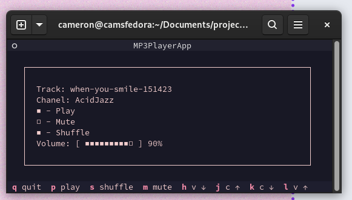

# 1 Announcing My LoFi Terminal Radio

This was a short weekend project I threw together to replace the
perpetually open YouTube Tab for [lofi beats to relax/study
to](https://www.youtube.com/watch?v=jfKfPfyJRdk). The result? A
minimalist audio player that does its job without any frills. Here\'s
why I created it and how it works.

# 2 What is it

In short, it is an audio player with a very specific emphasis on
being: - minimalist - distraction-free You cannot select tracks, replay
tracks or go to the next track. This is a feature, not a shortcoming. If
you want different music, change the station.

The aim of this is to provide an experience akin to radio. You can turn
it on, change the volume and switch the channel, but the programming is
up to the DJ.

# 3 Why Design it like this

This program isn\'t to replace your spotify or main music player.
Instead it is to replace your [lofi beats to relax/study
to](https://www.youtube.com/watch?v=jfKfPfyJRdk) Youtube tab that stays
open while you work. The channel has 15k streamers on it when I checked,
and has streaming uninterrupted since July 2022.

Why does this exist? Much like some art makes you think, and some exists
just to decorate space. Some music exists to make you think, and some
exist to decorate time. When you get these two types confused your
\"background music\" can become the focus, distracting you from the work
you are meant to be doing. These \"lofi hip-hop\" streams exist to play
background music and remove the temptation of fiddling with the
playlist.

The problem is, a 1080p video stream running in a web browser is
super-overkill for listening to music. It wastes network bandwidth,
computer memory, and CPU cycles. On top of this, it removes the
distraction of fiddling with playlists but replaces it with the visual
clutter of an unnecessary browser tab next to your actual work

# 4 My Solution

A tool to replace this should have 1. No way to select tracks or
configure playlists from the UI 2. Stay out of the way when you aren\'t
using it

For this, I settled on a discrete terminal app that I can stash neatly
out of the way. Especially when I leave it running in my [Quake
Terminal](https://extensions.gnome.org/extension/6307/quake-terminal/)
extension for GNOME.

# 5 Where Do I install it?

Install instructions at [My
Repo](https://github.com/CJones-Optics/lofi-player)

# 6 Customising it

## 6.1 Colours!

The UI is determined by css, with the colours defined at the top of the
file. Change your colour scheme to whatever you want just by changing
the hex codes at the top of the css file.

## 6.2 Keybindings!

Don\'t like vim? Iwon\'t hold it against you. There is a simple text
file of the keybindings. Change the key to whatever you need.

# 7 Does it work on:

-   Linux
    -   **Yes!** I have tested it on two machines and a virtual machine
-   Mac
    -   **Probably!** I haven\'t tested. Try it and let me know. I
        can\'t afford a Macbook.
-   Windows
    -   **Eventually!** There are some bugs specific to Window\'s
        implementation of Python. (Or maybe Linux\'s implementation?)
        Either way, it doesn\'t work as perfectly on Windows. It will be
        fixed when I get around to it.

# 8 This is all well and good, but who has MP3 files anymore?

You got me there! Spotify support isn\'t really something I can be
bothered messing with. Instead, I built my playlists from the Royalty
Free resources available at
[Pixbay](https://pixabay.com/music/search/lofi/), but for artists, you
are genuinely fond of you can actually support them by buying their
music through Bandcamp.

# 9 Technical Details

## 9.1 Frameworks

-   Both the backend and UI are written in Python
    -   Backend uses PyGame to handle the mp3 playback
    -   Frontend uses the Textual Framework to handle keybindings, and
        tcss for a css-like experience configuring the UI

## 9.2 How it works:

-   The player process grabs a directory of mp3 files, and a playlist
    object grabs each file one at a time, and throws it at the player
    object when it needs a new song.
-   A queue is used to pass commands from the UI in TUI.py, to the
    process in musicPlayer.py and messages back in the other direction.

## 9.3 Customisability

At the moment the application is optimised for my specific use case. And
I am very opinionated. This means: -The entire program is controlled
from the keyboard, with vim keybindings - No \"Next\" button is exposed
in the UI.

Thankfully, the frameworks used are very flexible, allowing for easy
hackability. To change the colours of the UI, you only need to change
the hexcodes in `style.tcss`. To add mouse support, you can easily
implement buttons using Textualise\'s built-in widgets. In fact, the
repo has a spare folder for GUI elements I designed, (then removed) to
get you started.

The process also already has a command written for the next track. You
only need to add the UI element if you really want it.

# 10 Future Changes

Future changes are unlikely because it currently fits my use case.
However for the sake of completeness, here is how I may extend the
application. - Custom theming. - At the moment I have a Catpuccino theme
hardcoded into it. An implementation to vary the colour scheme would be
simple to implement and highly beneficial - Implement GUI and Mouse
Support. - I have a soft spot for text-only UIs, which is why it is
implemented like this. The framework does support buttons for mouse UIs
though. The app does work with buttons but I thought they were ugly and
removed them. Check the commit history for implementation -Old School
animated music visualiser: - This is somewhat antithetical to the design
philosophy, but they are a lot of fun. I plan on building one
eventually.\
- GUI Support Cont: Implement a list feature for all the stations.

# 11 Conclusion

The LoFi Terminal Radio aims to provide a distraction-free,
resource-efficient alternative to streaming background music. If you\'re
looking for a minimalist approach to your work soundtrack, give it a
try! Feedback and contributions are always welcome.
