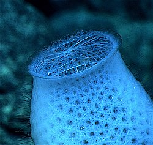
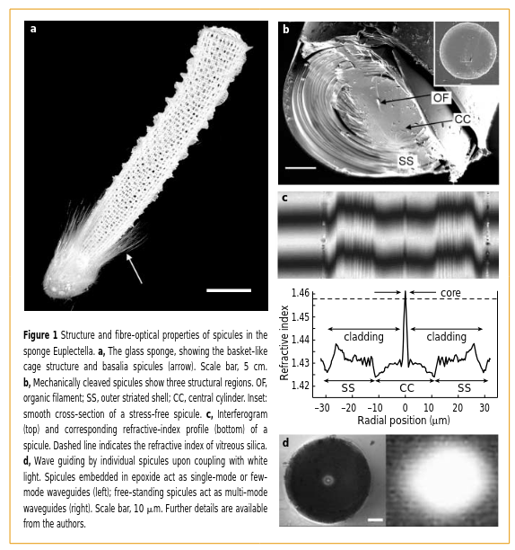

Biology was never not cool to be honest, but I stumbled upon another mind melting phenomenon.

## The [Venus' flower basket](https://en.wikipedia.org/wiki/Venus%27_flower_basket)

**Credit: [Wikimedia](https://en.wikipedia.org/wiki/File:Expn4384_(27840605922).jpg)**

Is a deep sea sponge that grows between 500m - 1km underwater (although it can be found as shallow as 100m), and is MADE OF GLASS.

Even cooler than the fact that this sponge manages to grow glass biologically while underwater, [IT TURNS THE GLASS FILAMENTS INTO SINGLE MODE OPTIC FIBERS](https://www.researchgate.net/profile/Micha-Ilan/publication/10603716_Fiber-_optical_Features_of_a_Glass_Sponge/links/00b7d533c042ed2b87000000/Fiber-optical-Features-of-a-Glass-Sponge.pdf?origin=publication_detail&_tp=eyJjb250ZXh0Ijp7ImZpcnN0UGFnZSI6InB1YmxpY2F0aW9uIiwicGFnZSI6InB1YmxpY2F0aW9uRG93bmxvYWQiLCJwcmV2aW91c1BhZ2UiOiJwdWJsaWNhdGlvbiIsInBvc2l0aW9uIjoiZ2xvYmFsRm9vdGVyIn19) This was presented back in a 2003 nature article. 

Anyway, short one for today. Just wanted to share something I thought was crazy cool.
