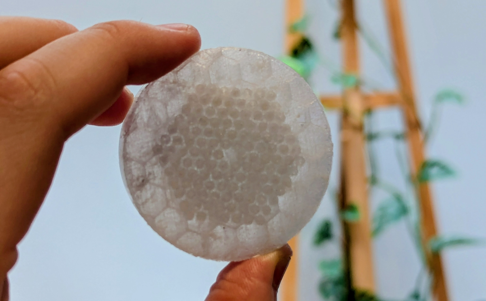

As promised, I printed it in transparent PETG.... *And it looked terrible*. Somehow the internal support is more visible than the holes I was trying to show, which instead got clogged up.

Oh well. I will stick with my Blue PLA one.

